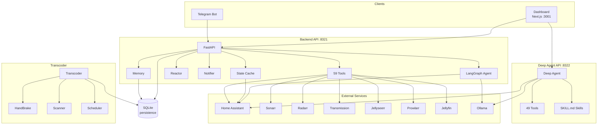

# HomeBotAI Architecture

## System Overview

HomeBotAI ties a Next.js dashboard, Telegram bot, and optional CLI to a FastAPI backend that runs a LangGraph ReAct agent with layered memory, Home Assistant state mirroring, scheduled and reactive automations, and a large tool surface for media and home control. A separate Deep Agent service exposes an alternate agent stack with its own tool modules. A Transcoder service handles library scans and HandBrake jobs. SQLite backs conversational and app data; external APIs cover Home Assistant, *arr stack, Jellyfin, and optional local LLMs.



## Backend

### Entry Points

| Entry Point | File | Purpose | Transport |
|-------------|------|---------|-----------|
| Telegram | `main.py` | Production chat via Telegram | Long polling |
| API | `api.py` | REST + SSE for dashboard/testing | HTTP (:8321) |
| CLI | `cli.py` | Developer interactive REPL | stdin/stdout |

`bootstrap.py` provides `create_app()` which initializes memory stores, registers all 59 tools, builds the LangGraph agent, and connects the HA WebSocket state cache.

### Agent (agent.py)

- Model: `gemini-2.5-flash` via `langchain-google-genai`, with Ollama support via `llm.py`
- Orchestration: `langgraph.prebuilt.create_react_agent` (ReAct loop)
- System prompt: dynamically built with live HA state, learned skills, semantic memory
- Streaming: `run_stream()` yields typed events

### Memory (3-Layer)

| Layer | Purpose | Storage | Lifecycle |
|-------|---------|---------|-----------|
| Episodic | Chat history | SQLite, per chat_id | Auto-trimmed to 50 |
| Semantic | User prefs, facts | SQLite key-value | Persistent |
| Procedural | Skills, routines | SQLite + event log | User-managed |

### Tools (59 registered)

| Category | Count | Key Tools | Source |
|----------|-------|-----------|--------|
| Home Assistant | 4 | `ha_call_service`, `ha_get_camera_snapshot`, `ha_trigger_automation`, `ha_fire_event` | `tools/homeassistant.py` |
| Skills | 7 | `create_skill`, `execute_skill`, `list_skills`, `update_skill`, `delete_skill`, `toggle_skill`, `get_event_log` | `tools/skills.py` |
| Memory | 2 | `remember`, `recall` | `tools/memory_tools.py` |
| Scenes | 3 | `create_scene`, `activate_scene`, `delete_scene` | `tools/scenes.py` |
| Sonarr | 8 | `sonarr_search`, `sonarr_add_series`, +6 more | `tools/sonarr.py` |
| Radarr | 8 | `radarr_search`, `radarr_add_movie`, +6 more | `tools/radarr.py` |
| Transmission | 8 | `transmission_get_torrents`, `transmission_add_torrent`, +6 more | `tools/transmission.py` |
| Jellyseerr | 5 | `jellyseerr_search`, `jellyseerr_request`, +3 more | `tools/jellyseerr.py` |
| Prowlarr | 5 | `prowlarr_search`, `prowlarr_get_indexers`, +3 more | `tools/prowlarr.py` |
| Jellyfin | 9 | `jellyfin_search`, `jellyfin_playback_control`, +7 more | `tools/jellyfin.py` |

### State Cache (state.py)

Live in-memory mirror of HA entities via WebSocket. Context-aware filtering, anomaly detection, recent changes tracking.

### Reactor (reactor.py)

Schedule triggers (cron via APScheduler) and state change triggers. Skills define triggers the reactor monitors.

### Notifier (notifier.py)

Proactive Telegram notifications: printer finished, battery low (<15%), welcome/left home. 5-minute cooldown per entity.

### LLM Module (llm.py)

Provider abstraction for Google GenAI and Ollama. Used for skill execution, dashboard summaries, media discovery.

### API Endpoints (65+ routes)

Brief table of endpoint groups:

| Group | Count | Key Paths |
|-------|-------|-----------|
| Chat | 5 | `/api/chat`, `/api/chat/stream`, `/api/chat/threads` |
| Skills | 6 | `/api/skills`, `/api/skills/{id}/execute` |
| Entities | 4 | `/api/entities`, `/api/entities/{id}/toggle` |
| Dashboard | 6 | `/api/dashboard`, `/api/dashboard/edit`, `/api/generate-widget` |
| Media | 9 | `/api/media/overview`, `/api/media/search`, `/api/media/discover` |
| Scenes | 4 | `/api/scenes`, `/api/scenes/{id}/activate` |
| Server | 5 | `/api/server/containers`, `/api/server/tunnel` |
| Others | 26+ | health, tools, events, memory, cameras, network, energy, analytics, reports, floorplan, aliases, notifications |

Full reference: see [API Reference](docs/api-reference.md) or Swagger at http://localhost:8321/docs

### Configuration (config.py)

Loads `.env` via python-dotenv. Handles SSL certificate merging for macOS.

### Testing

- `tests/backend/` -- Agent and service connectivity tests
- `tests/llm/` -- LLM benchmark and tool calling test suites

## Dashboard

### Tech Stack

| Technology | Version | Purpose |
|------------|---------|---------|
| Next.js | 15 | App Router, React 19 |
| TypeScript | 5 | Type safety |
| Tailwind CSS | 3.4 | Styling |
| Framer Motion | 11 | Animations |
| react-grid-layout | -- | Drag-and-drop widget layout |

### Pages (18)

| Route | Purpose |
|-------|---------|
| `/` | Dashboard -- AI-customizable widget grid |
| `/chat` | AI conversation with SSE streaming |
| `/devices` | Entity browser (domain filters, search) |
| `/cameras` | Live camera snapshots |
| `/activity` | Event log with filters |
| `/energy` | Power/energy charts, battery levels |
| `/network` | Mesh nodes, clients, bandwidth |
| `/media` | Unified media management |
| `/health` | Wearable health metrics |
| `/analytics` | Historical trends |
| `/reports` | Long-term data summaries |
| `/skills` | Skill manager with triggers |
| `/home-map` | Interactive SVG floorplan |
| `/memory` | Semantic memory facts |
| `/tools` | Tool reference by category |
| `/settings` | Notification rules, aliases |
| `/server` | Docker, Cloudflare, backups |
| `/transcoder` | Library browser, transcode jobs |

### Widget System

19 widget components rendered by `DashboardRenderer` from JSON config. `WidgetBuilder` for AI-powered creation via generative UI. react-grid-layout for drag-and-drop positioning.

### Data Flow: Chat Request

```
User types message in Dashboard
  |
  v
useChat hook opens SSE connection to POST /api/chat/stream
  |
  v
Backend: agent.run_stream() starts LangGraph ReAct loop
  |
  +---> Yields "thinking" event --> Dashboard shows spinner
  |
  +---> Yields "tool_call" event --> Dashboard shows tool name + args
  |       |
  |       v
  |     Tool executes (e.g., ha_call_service)
  |       |
  |       v
  +---> Yields "tool_result" event --> Dashboard shows result + duration
  |
  +---> Yields "response" event --> Dashboard renders final answer
  |
  v
SSE stream closes, chat turn complete
```

## Deep Agent

Standalone LangChain Deep Agent service on port 8322. 49 tools across 8 modules (HA, Sonarr, Radarr, Jellyfin, Transmission, Jellyseerr, Prowlarr, Render UI). SKILL.md skills for progressive disclosure. Model policy routes between Google GenAI and Ollama.

See [Deep Agent docs](docs/deep-agent.md) for full details.

## Transcoder

HandBrake-based media transcoding service. Library scanning, job management, preset system, scheduled scans. FastAPI with its own SQLite database.

See [Transcoder docs](docs/transcoder.md) for full details.

## Docker Deployment

```yaml
homebot:
  build: ./backend
  env_file: ./backend/.env
  volumes: ["./backend/data:/app/data"]
  ports: ["8321:8321"]

homebot-dashboard:
  build: ./dashboard
  environment:
    - NEXT_PUBLIC_API_URL=http://homebot:8321
  ports: ["3001:3000"]
  depends_on: [homebot]

homebot-deepagent:
  build: ./deepagent
  env_file: ./deepagent/.env
  ports: ["8322:8322"]

transcoder:
  build: ./transcoder
  env_file: ./transcoder/.env
  volumes: ["./transcoder/data:/app/data", "/path/to/media:/media"]
```

## Documentation

Full documentation site: https://kanakjr.github.io/homebot/
