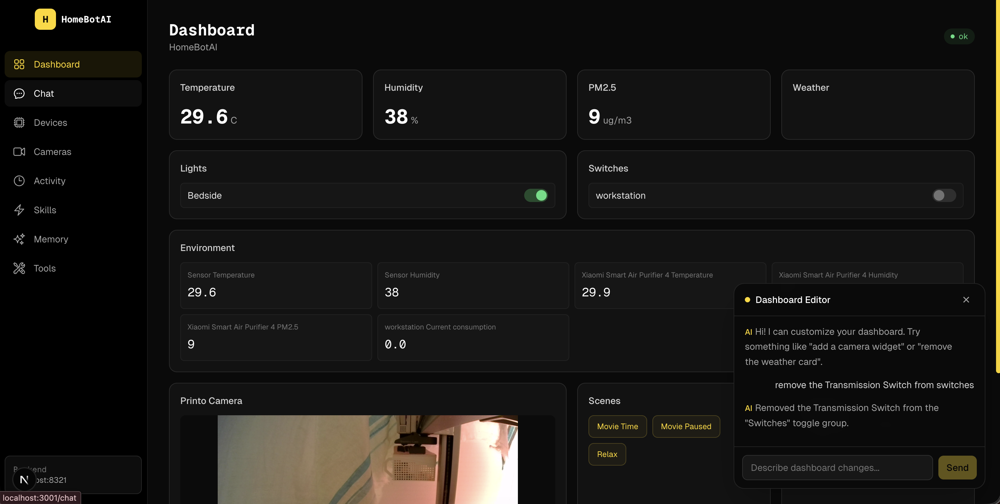
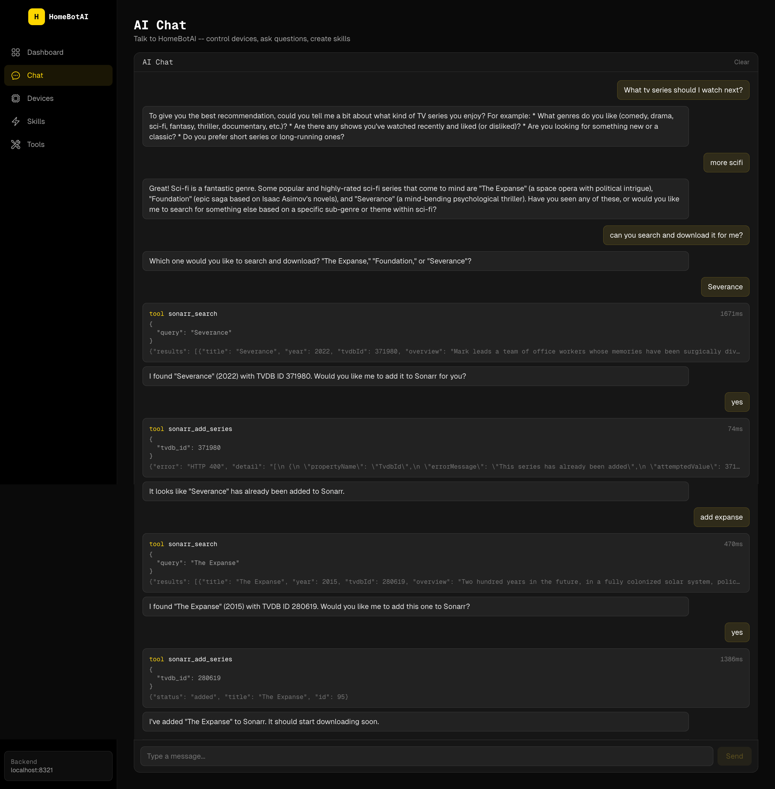
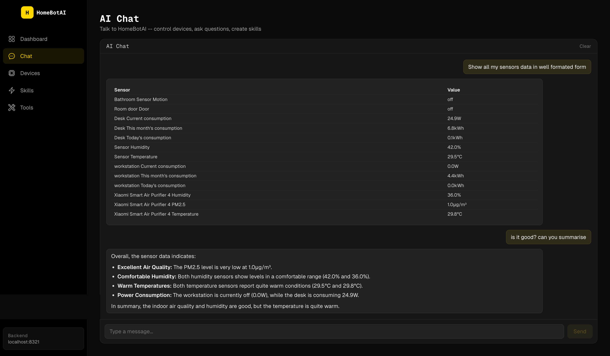
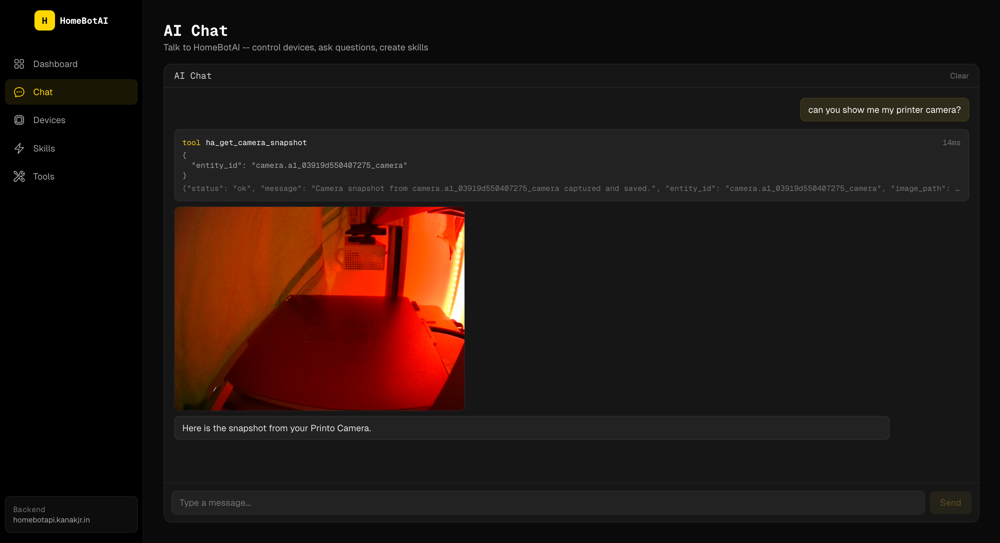
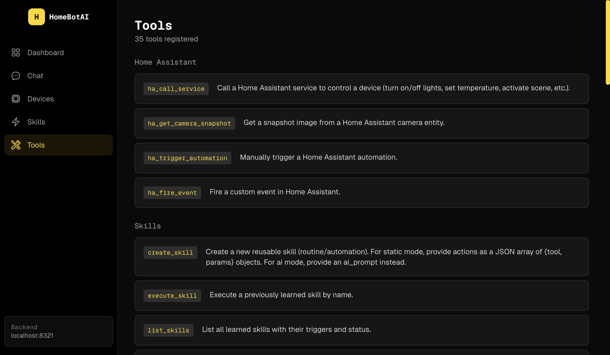
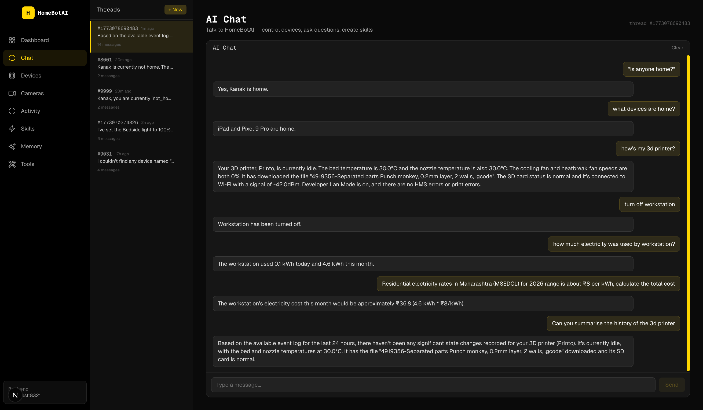
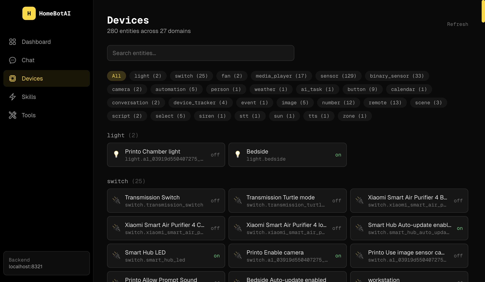
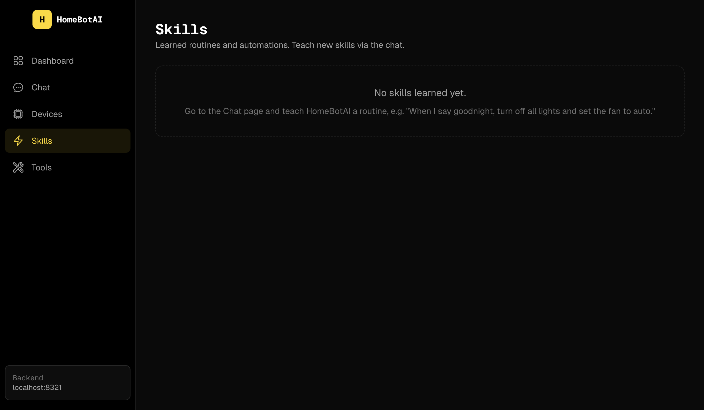

# HomeBotAI

Intelligent smart-home assistant powered by LangChain + Gemini, with live Home Assistant awareness, learnable skills, proactive automations, and a modern dashboard UI.



## Features

### AI-Customizable Dashboard

Widget-based homepage driven by a JSON config. A floating AI assistant (bottom-right) lets you customize the layout via natural language -- add widgets, remove cards, rearrange sections. Changes are persisted in SQLite and survive restarts. Widgets include stat cards, toggle groups, sensor grids, camera previews, scene buttons, and quick actions.

### Natural Language Device Control

Control any Home Assistant device through conversational commands. Set light colors, adjust brightness, toggle switches -- the agent resolves entity names and calls the right HA services automatically, with full tool-call transparency in the chat UI.


### Smart Media Management

Get TV/movie recommendations and manage your media stack through chat. The agent searches Sonarr, Prowlarr, Jellyseerr, and Transmission, finds the right content, and kicks off downloads -- all in a single conversation.



### Sensor Data Analysis

Ask about your home environment and get formatted sensor summaries with AI-powered analysis. The agent reads live HA sensor data and presents it as structured tables with contextual insights on air quality, temperature, humidity, and power consumption.



### Live Camera Snapshots

Ask the agent to show you any Home Assistant camera and it grabs a live snapshot on demand, rendered directly in the chat. Monitor 3D prints, check security cameras, or peek at any connected feed -- all through natural language.



### 35 Integrated Tools

Home Assistant control, Sonarr, Transmission, Jellyseerr, Prowlarr, Jellyfin, n8n workflows, learnable skills, and three-layer memory (episodic, semantic, procedural) -- all accessible via natural language.



### Smart Home Awareness

WebSocket subscription mirrors 280+ HA entities in memory. Context-aware state summaries are injected into every LLM call -- mentioning "printer" automatically includes 3D printer telemetry, asking about "batteries" surfaces all device levels, and recent state changes are always visible. The agent detects anomalies (low battery, high power draw, open doors) and flags them proactively.





### Presence Tracking

Device trackers (phones, watches, tablets) and person entities are part of every conversation. The agent knows who's home, which devices are nearby, and can trigger location-based automations.

### Proactive Notifications

Automatic Telegram alerts without asking -- 3D printer finished, battery critically low (<15%), welcome home with lights status, left home with devices still on. Built-in rules with cooldown to prevent spam.

### AI Digests

Scheduled daily and weekly AI-generated summaries sent via Telegram. The daily digest (10 PM) covers activity, energy, and notable events. The weekly report (Sunday 8 PM) analyzes power trends and device usage patterns.

### Learnable Skills

Teach the agent reusable routines via chat ("When I say goodnight, turn off all lights and set the fan to auto"). Skills are stored as procedural memory and can be triggered by name, cron schedules, or HA state changes.



## Architecture


> Regenerate after changes: `./docs/generate-diagrams.sh`

## Documentation

- [ARCHITECTURE.md](ARCHITECTURE.md) -- System design, data flows, and component breakdowns
- [docs/AI_DASHBOARD.md](docs/AI_DASHBOARD.md) -- AI-customizable dashboard: widget types, editor usage, config schema
- [docs/SMART_FEATURES.md](docs/SMART_FEATURES.md) -- Presence tracking, smart summaries, AI digests, proactive notifications

## Project Structure

```
homebot/
  backend/          Python AI agent, API, CLI, Telegram bot
  dashboard/        Next.js dashboard UI
  docs/
    screenshots/    Dashboard and page screenshots
    chats/          Chat conversation examples
  README.md         This file
  ARCHITECTURE.md   System architecture docs
```

## Backend

LangChain/LangGraph ReAct agent with three-layer memory and 35 tools spanning Home Assistant, media services (Sonarr, Transmission, Jellyseerr, Prowlarr, Jellyfin), n8n workflows, and skill management.

Entry points:
- `main.py` -- Telegram bot (production)
- `api.py` -- FastAPI REST API with SSE streaming (default port 8321)
- `cli.py` -- Interactive Rich CLI for development

## Dashboard

Next.js 15 frontend with dark cyber-yellow theme, Geist Sans/Mono fonts, Tailwind CSS, and Framer Motion animations. Pure client-side -- no backend logic, no database, no LLM calls.

Pages: Dashboard (AI-customizable widget grid), Chat (AI conversation with SSE streaming and tool visibility), Devices (280 HA entities with domain filters), Cameras (live snapshots), Activity (event log), Skills (learned routines), Memory (semantic facts), Tools (35 registered tools reference).

## Quick Start

### Backend (local dev)

```bash
cd backend
python3 -m venv ../.venv
source ../.venv/bin/activate
pip install -r requirements.txt
cp .env.example .env   # fill in your tokens
python cli.py           # interactive CLI
python api.py           # REST API on :8321
python main.py          # Telegram bot
```

### Dashboard (local dev)

```bash
cd dashboard
npm install
cp .env.example .env.local   # set NEXT_PUBLIC_API_URL=http://localhost:8321
npm run dev                   # http://localhost:3001
```

### Production build

```bash
cd dashboard
npm run build
npm start -- -p 3001
```

### Docker

```bash
docker compose up -d homebot homebot-dashboard
```

- Backend API: `http://localhost:8321`
- Dashboard: `http://localhost:3001`
- Telegram bot runs automatically inside the backend container

## Environment Variables

### Backend (`backend/.env`)

| Variable | Required | Description |
|----------|----------|-------------|
| `TELEGRAM_BOT_TOKEN` | Yes | Telegram Bot API token |
| `GEMINI_API_KEY` | Yes | Google Gemini API key |
| `GEMINI_MODEL` | No | Model name (default: `gemini-2.5-flash`) |
| `HA_URL` | Yes | Home Assistant URL |
| `HA_TOKEN` | Yes | HA long-lived access token |
| `DB_PATH` | No | SQLite path (default: `./data/homebot.db`) |
| `LANGSMITH_TRACING` | No | Enable LangSmith tracing (`true`) |
| `LANGSMITH_API_KEY` | No | LangSmith API key |
| `LANGSMITH_PROJECT` | No | LangSmith project name |
| `N8N_URL` | No | n8n automation URL |
| `SONARR_URL` | No | Sonarr API URL |
| `SONARR_API_KEY` | No | Sonarr API key |
| `TRANSMISSION_URL` | No | Transmission RPC URL |
| `JELLYSEERR_URL` | No | Jellyseerr API URL |
| `JELLYSEERR_API_KEY` | No | Jellyseerr API key |
| `PROWLARR_URL` | No | Prowlarr API URL |
| `PROWLARR_API_KEY` | No | Prowlarr API key |
| `JELLYFIN_URL` | No | Jellyfin API URL |
| `JELLYFIN_API_KEY` | No | Jellyfin API key |
| `CORS_ORIGINS` | No | Comma-separated allowed origins (default: `http://localhost:3001`) |

### Dashboard (`dashboard/.env.local`)

| Variable | Required | Description |
|----------|----------|-------------|
| `NEXT_PUBLIC_API_URL` | Yes | Backend API base URL (e.g. `http://localhost:8321`) |

## Testing

### Service connectivity tests

```bash
cd backend
python tests/test_services.py                    # all services
python tests/test_services.py transmission       # single service
python tests/test_services.py jellyfin prowlarr  # multiple services
```

### Agent tests

```bash
cd backend
python tests/test_agent.py
```

## API Reference

| Method | Path | Description |
|--------|------|-------------|
| POST | `/api/chat` | Blocking chat -- returns full response + tool calls |
| POST | `/api/chat/stream` | SSE stream of real-time events |
| GET | `/api/health` | System status (tools, entities, model) |
| GET | `/api/tools` | List all registered tools |
| GET | `/api/skills` | List learned skills |
| GET | `/api/entities` | HA entities grouped by domain |
| POST | `/api/entities/{id}/toggle` | Toggle a switch/light/fan entity |
| GET | `/api/events` | Event log with time filtering |
| GET | `/api/memory` | Semantic memory facts |
| POST | `/api/cameras/{id}/snapshot` | Request a camera snapshot |
| GET | `/api/dashboard` | Dashboard widget config |
| PUT | `/api/dashboard` | Save dashboard config |
| POST | `/api/dashboard/edit` | AI-edit dashboard layout via natural language |

Swagger docs: `http://localhost:8321/docs`
