# HomeBotAI

Intelligent smart-home assistant powered by LangChain + Gemini, with live Home Assistant awareness, learnable skills, proactive automations, and a modern dashboard UI.

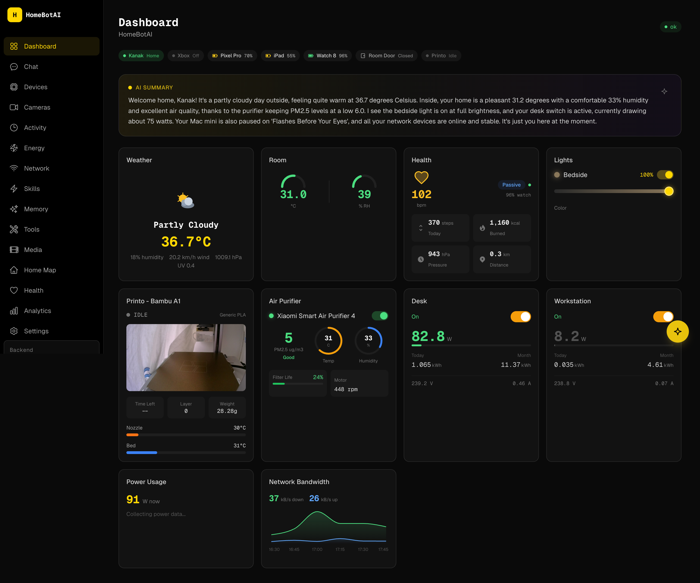

## Features

### AI-Customizable Dashboard

Widget-based homepage driven by a JSON config. A floating AI assistant (bottom-right) lets you customize the layout via natural language -- add widgets, remove cards, rearrange sections. Changes are persisted in SQLite and survive restarts. Widgets include stat cards, toggle groups, sensor grids, camera previews, scene buttons, and quick actions.

### Natural Language Device Control

Control any Home Assistant device through conversational commands. Set light colors, adjust brightness, toggle switches -- the agent resolves entity names and calls the right HA services automatically, with full tool-call transparency in the chat UI.

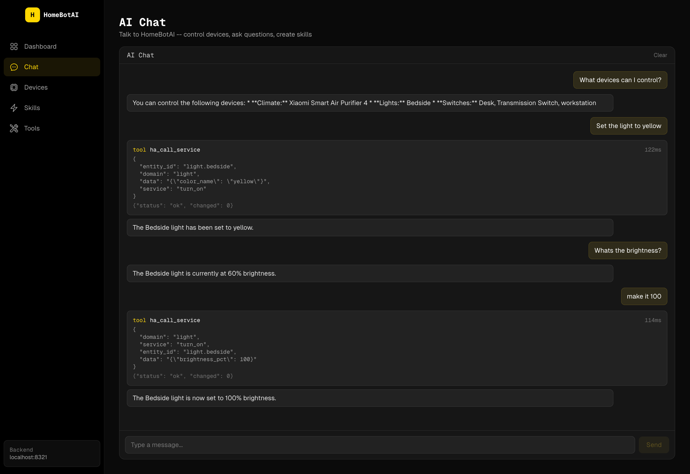

### Smart Media Management

Get TV/movie recommendations and manage your media stack through chat. The agent searches Sonarr, Prowlarr, Jellyseerr, and Transmission, finds the right content, and kicks off downloads -- all in a single conversation.


### Sensor Data Analysis

Ask about your home environment and get formatted sensor summaries with AI-powered analysis. The agent reads live HA sensor data and presents it as structured tables with contextual insights on air quality, temperature, humidity, and power consumption.

### Live Camera Snapshots

Dedicated cameras page with live snapshots from all Home Assistant camera entities. Auto-refresh on a 15-second interval, manual snapshot on demand, and streaming status indicators. Ask the agent in chat to show any camera and it renders the snapshot inline.

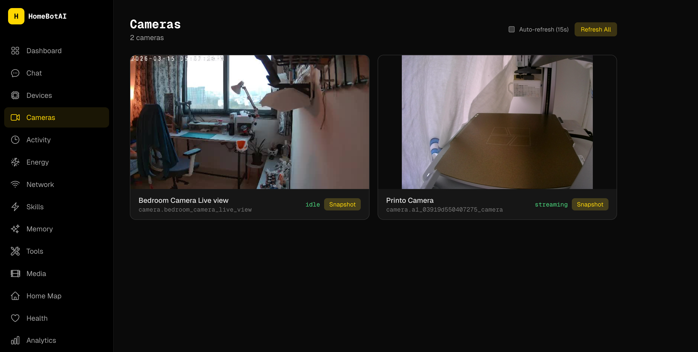

### Scenes -- State Snapshot and Restore

Snapshot the current state of any set of devices (lights, fans, climate) and restore them with a single command. Scenes capture entity states and attributes (brightness, color temperature, fan mode) and can be activated from the dashboard, the chat agent, or the Home Map. Stored in SQLite for persistence.

### Interactive Home Map

A dedicated floorplan page with an inlined SVG floor plan showing live device states as colored overlays. Lights glow when on, sensors display readings, and devices are clickable for direct toggle control. Configured via a device-to-SVG mapping stored in the database.

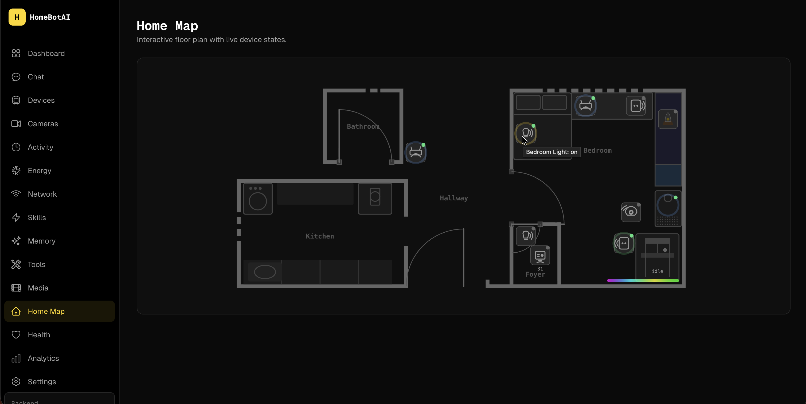

### 42 Integrated Tools

Home Assistant control, Sonarr, Radarr, Transmission, Jellyseerr, Prowlarr, Jellyfin, learnable skills, scene management, and three-layer memory (episodic, semantic, procedural) -- all accessible via natural language.

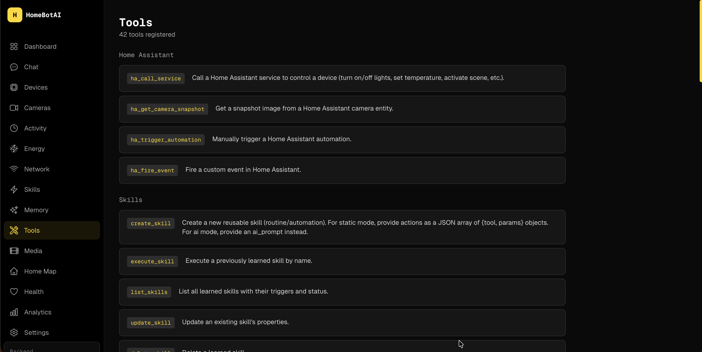

### Smart Home Awareness

WebSocket subscription mirrors 307 HA entities in memory. Context-aware state summaries are injected into every LLM call -- mentioning "printer" automatically includes 3D printer telemetry, asking about "batteries" surfaces all device levels, and recent state changes are always visible. The agent detects anomalies (low battery, high power draw, open doors) and flags them proactively.

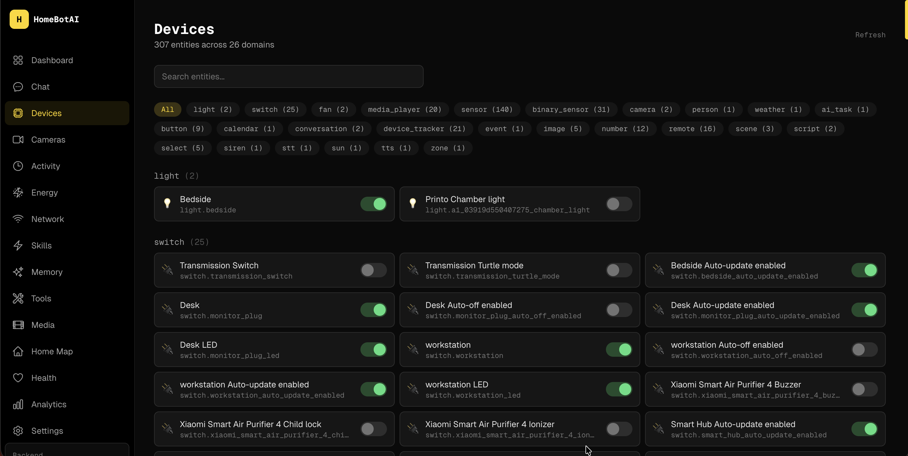

### Presence Tracking

Device trackers (phones, watches, tablets) and person entities are part of every conversation. The agent knows who's home, which devices are nearby, and can trigger location-based automations.

### Proactive Notifications

Automatic Telegram alerts without asking -- 3D printer finished, battery critically low (<15%), welcome home with lights status, left home with devices still on. Built-in rules with cooldown to prevent spam.

### AI Digests

Scheduled daily and weekly AI-generated summaries sent via Telegram. The daily digest (10 PM) covers activity, energy, and notable events. The weekly report (Sunday 8 PM) analyzes power trends and device usage patterns.

### Energy Dashboard

Track power consumption, energy usage, and battery levels across all your devices. Live power gauges show real-time wattage with color-coded thresholds, area charts visualize consumption over configurable time ranges (6h to 7d), and battery cards surface low devices at a glance. Data comes from HA power/energy/battery sensors and the event log history.

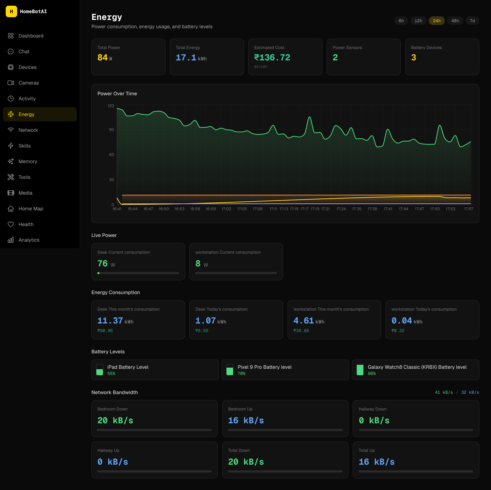

### Network Monitoring

TP-Link Deco mesh status with live bandwidth per node, connected device inventory grouped by access point, and bandwidth-over-time charts. Filter by active/offline devices, see per-client throughput, and track internet connectivity.

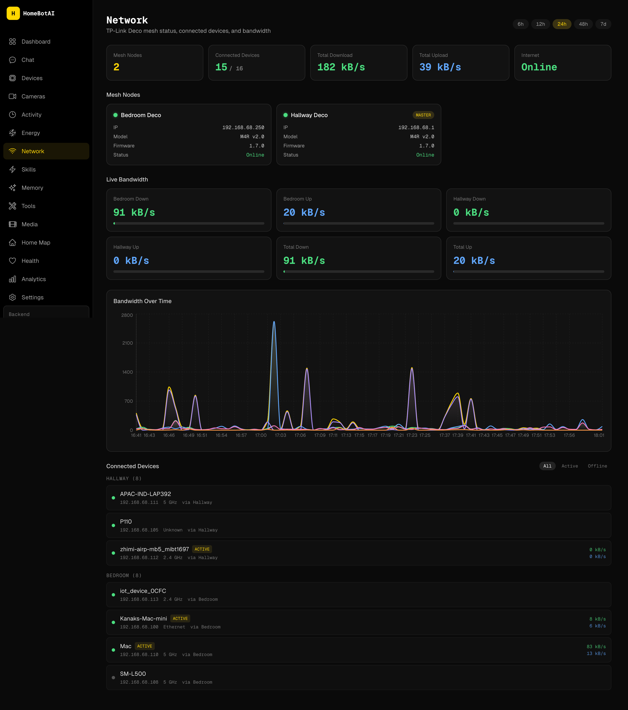

### Media Dashboard

Unified media management page -- now playing from Jellyfin, active downloads from Transmission, TV and movie queues from Sonarr/Radarr, library browsing, and Jellyseerr request status. Search across all services from a single search bar.

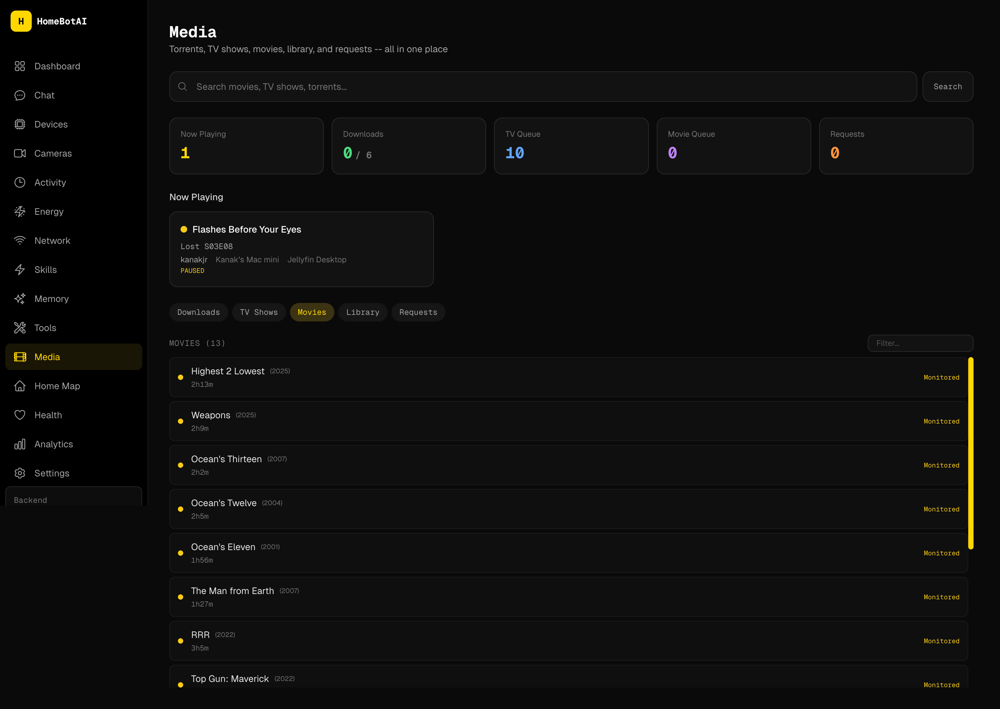

### Health Tracking

Personal health dashboard pulling data from wearables via Home Assistant. Heart rate monitoring with history charts, daily activity rings (steps, calories, distance, floors), sleep tracking with quality indicators, and device battery levels. Data sourced from Galaxy Watch and Pixel sensors.

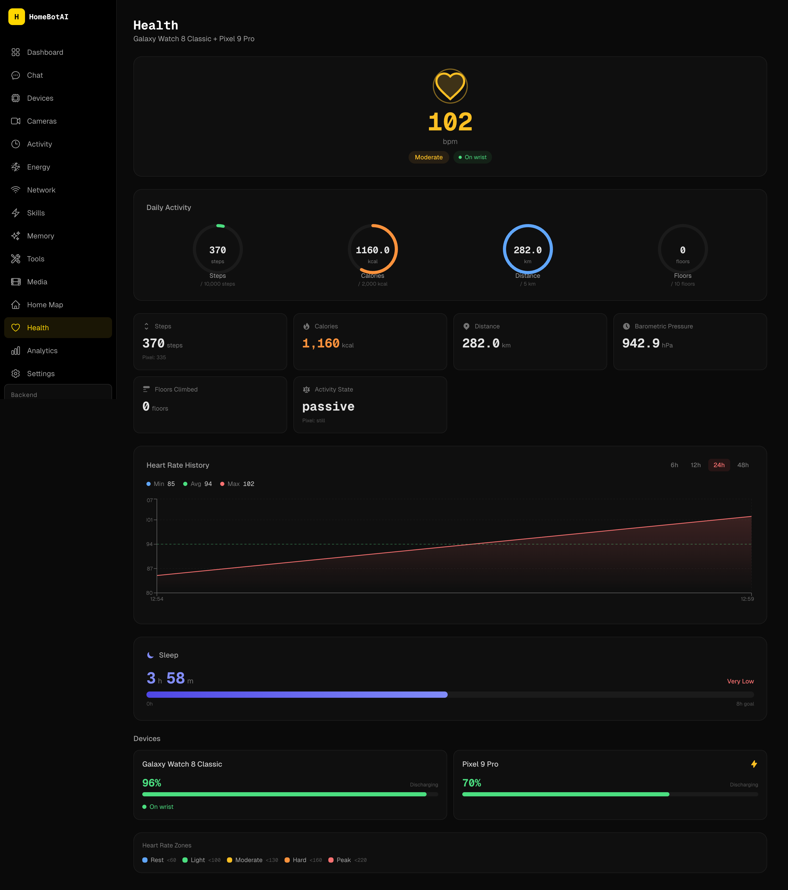

### Analytics

Historical trends and patterns across your smart home. Activity frequency, energy consumption over time, presence tracking, and network usage -- all with configurable time ranges (7d, 14d, 30d) and metric selectors.

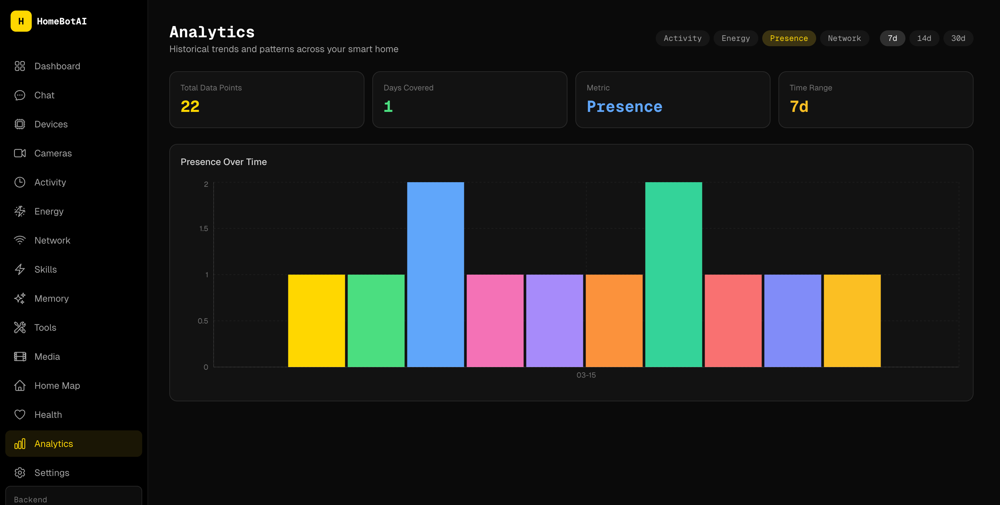

### Learnable Skills

Teach the agent reusable routines via chat ("When I say goodnight, turn off all lights and set the fan to auto"). Skills are stored as procedural memory and can be triggered by name, cron schedules, or HA state changes.

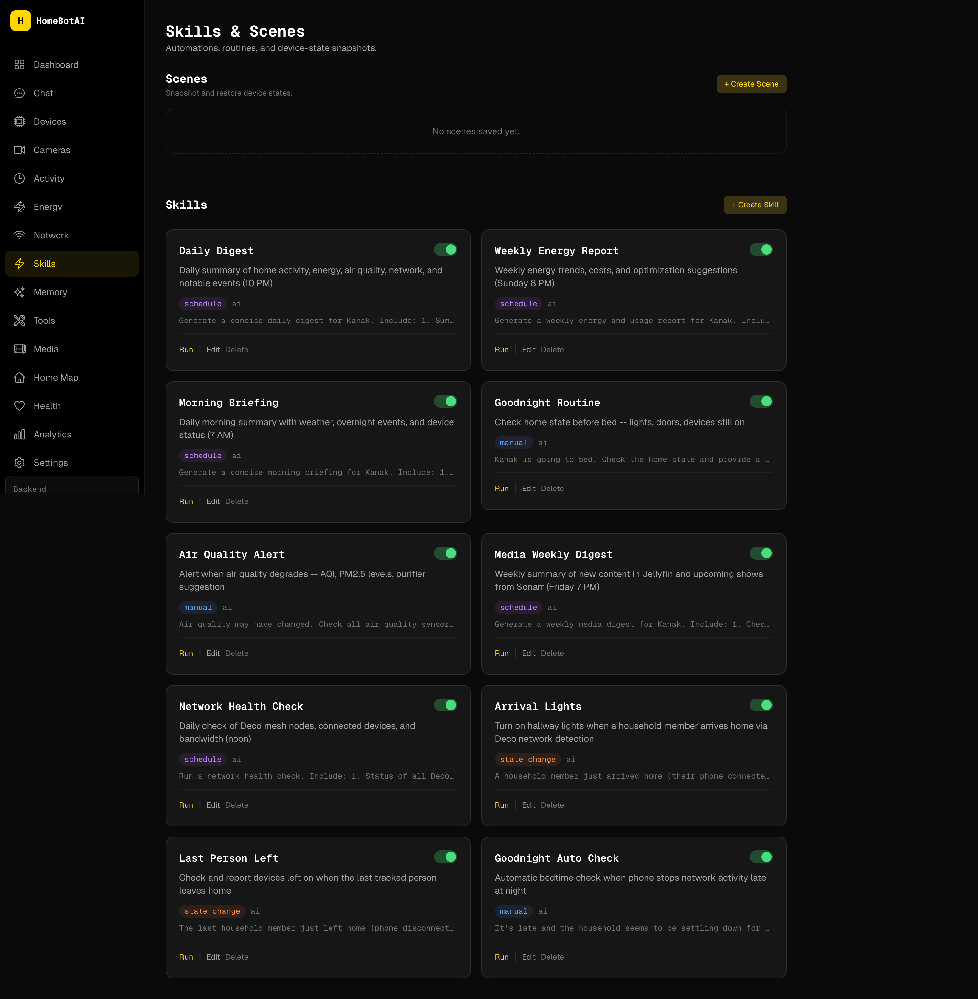

### Activity Log

Real-time event stream of all HA state changes with domain filtering (camera, device_tracker, sensor, switch) and configurable time windows (6h to 72h). Every entity change is logged with old/new values.

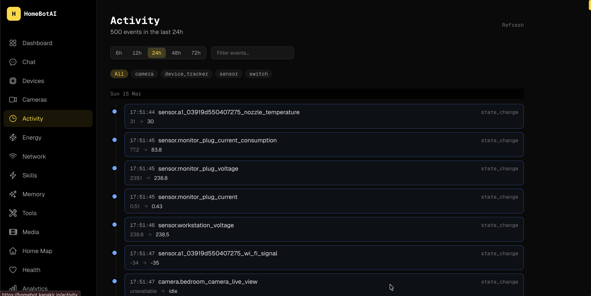

### Settings

Configure notification rules (3D printer done, battery low, welcome/left home, Deco node offline, device disconnect) with per-rule toggles and cooldowns. Manage device aliases for network clients and configure presence tracking devices.

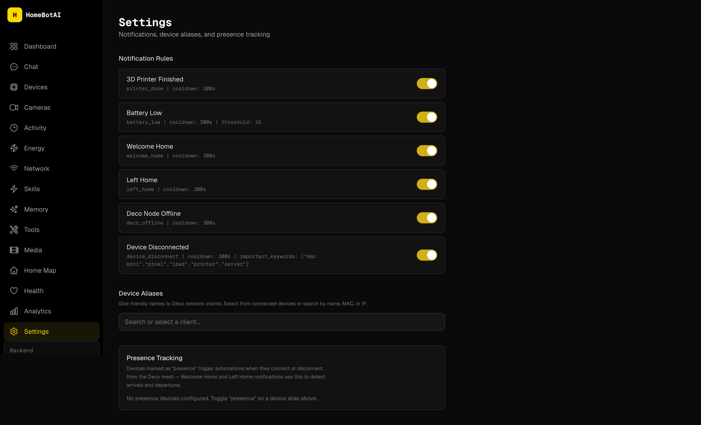

## Architecture

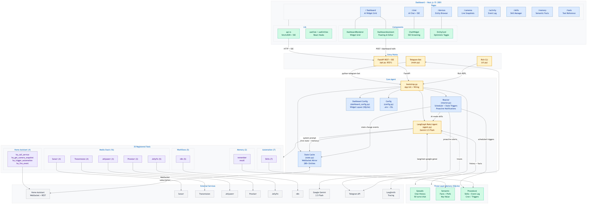

> Regenerate after changes: `./docs/generate-diagrams.sh`

## Documentation

- [ARCHITECTURE.md](ARCHITECTURE.md) -- System design, data flows, and component breakdowns
- [docs/AI_DASHBOARD.md](docs/AI_DASHBOARD.md) -- AI-customizable dashboard: widget types, editor usage, config schema
- [docs/SMART_FEATURES.md](docs/SMART_FEATURES.md) -- Presence tracking, smart summaries, AI digests, proactive notifications
- [docs/ROADMAP.md](docs/ROADMAP.md) -- Future roadmap: 15 planned features with priority, effort, and implementation details
- [docs/LLM_BENCHMARK_RESULTS.md](docs/LLM_BENCHMARK_RESULTS.md) -- Aggregated model benchmarks (task quality and tool calling); regenerate from `tests/llm/results/*.json`

## Project Structure

```
homebot/
  backend/          Python AI agent, API, CLI, Telegram bot
  dashboard/        Next.js dashboard UI
  docs/
    screenshots/    Dashboard and page screenshots
  README.md         This file
  ARCHITECTURE.md   System architecture docs
```

## Backend

LangChain/LangGraph ReAct agent with three-layer memory and 36 tools spanning Home Assistant, media services (Sonarr, Radarr, Transmission, Jellyseerr, Prowlarr, Jellyfin), scene management, and skill management.

Entry points:
- `main.py` -- Telegram bot (production)
- `api.py` -- FastAPI REST API with SSE streaming (default port 8321)
- `cli.py` -- Interactive Rich CLI for development

## Dashboard

Next.js 15 frontend with dark cyber-yellow theme, Geist Sans/Mono fonts, Tailwind CSS, and Framer Motion animations. Pure client-side -- no backend logic, no database, no LLM calls.

Fully mobile-responsive with slide-out drawer navigation on phones/tablets.

Pages: Dashboard (AI-customizable widget grid), Chat (AI conversation with SSE streaming and tool visibility), Devices (307 HA entities with domain filters), Cameras (live snapshots), Activity (event log), Energy (power/energy charts, battery levels), Network (Deco mesh nodes, connected clients, live bandwidth), Skills & Scenes (learned routines + state snapshots), Memory (semantic facts), Tools (42 registered tools reference), Media (unified media management), Analytics (historical trends), Health (wearable health metrics), Settings (notification rules, device aliases, presence tracking), Home Map (interactive SVG floorplan with live device overlays).

## Quick Start

### Backend (local dev)

```bash
cd backend
python3 -m venv ../.venv
source ../.venv/bin/activate
pip install -r requirements.txt
cp .env.example .env   # fill in your tokens
python cli.py           # interactive CLI
python api.py           # REST API on :8321
python main.py          # Telegram bot
```

### Dashboard (local dev)

```bash
cd dashboard
npm install
cp .env.example .env.local   # set NEXT_PUBLIC_API_URL=http://localhost:8321
npm run dev                   # http://localhost:3001
```

### Production build

```bash
cd dashboard
npm run build
npm start -- -p 3001
```

### Docker

```bash
docker compose up -d homebot homebot-dashboard
```

- Backend API: `http://localhost:8321`
- Dashboard: `http://localhost:3001`
- Telegram bot runs automatically inside the backend container

## Environment Variables

### Backend (`backend/.env`)

| Variable | Required | Description |
|----------|----------|-------------|
| `TELEGRAM_BOT_TOKEN` | Yes | Telegram Bot API token |
| `GEMINI_API_KEY` | Yes | Google Gemini API key |
| `GEMINI_MODEL` | No | Model name (default: `gemini-2.5-flash`) |
| `HA_URL` | Yes | Home Assistant URL |
| `HA_TOKEN` | Yes | HA long-lived access token |
| `DB_PATH` | No | SQLite path (default: `./data/homebot.db`) |
| `LANGSMITH_TRACING` | No | Enable LangSmith tracing (`true`) |
| `LANGSMITH_API_KEY` | No | LangSmith API key |
| `LANGSMITH_PROJECT` | No | LangSmith project name |
| `SONARR_URL` | No | Sonarr API URL |
| `SONARR_API_KEY` | No | Sonarr API key |
| `TRANSMISSION_URL` | No | Transmission RPC URL |
| `JELLYSEERR_URL` | No | Jellyseerr API URL |
| `JELLYSEERR_API_KEY` | No | Jellyseerr API key |
| `PROWLARR_URL` | No | Prowlarr API URL |
| `PROWLARR_API_KEY` | No | Prowlarr API key |
| `JELLYFIN_URL` | No | Jellyfin API URL |
| `JELLYFIN_API_KEY` | No | Jellyfin API key |
| `CORS_ORIGINS` | No | Comma-separated allowed origins (default: `http://localhost:3001`) |
| `ENERGY_RATE` | No | Electricity cost per kWh (default: `8`) |
| `ENERGY_CURRENCY` | No | Currency code for energy cost (default: `INR`) |

### Dashboard (`dashboard/.env.local`)

| Variable | Required | Description |
|----------|----------|-------------|
| `NEXT_PUBLIC_API_URL` | Yes | Backend API base URL (e.g. `http://localhost:8321`) |

## Testing

### Service connectivity tests

```bash
cd backend
python tests/test_services.py                    # all services
python tests/test_services.py transmission       # single service
python tests/test_services.py jellyfin prowlarr  # multiple services
```

### Agent tests

```bash
cd backend
python tests/test_agent.py
```

### LLM benchmarks

Runs write JSON under `tests/llm/results/`. Aggregate into `docs/LLM_BENCHMARK_RESULTS.md`:

```bash
python tests/llm/test_benchmark.py          # tasks from tests/llm/tasks.py
python tests/llm/test_tool_calling.py     # bind_tools scenarios
python tests/llm/aggregate_benchmark_doc.py
```

## API Reference

| Method | Path | Description |
|--------|------|-------------|
| POST | `/api/chat` | Blocking chat -- returns full response + tool calls |
| POST | `/api/chat/stream` | SSE stream of real-time events |
| GET | `/api/chat/threads` | List conversation threads |
| GET | `/api/chat/{id}/history` | Get message history for a thread |
| DELETE | `/api/chat/{id}/history` | Clear a thread's history |
| GET | `/api/health` | System status (tools, entities, model) |
| GET | `/api/health/data` | Health metrics time series |
| GET | `/api/tools` | List all registered tools |
| GET | `/api/skills` | List learned skills |
| POST | `/api/skills` | Create a new skill |
| PUT | `/api/skills/{id}` | Update a skill |
| DELETE | `/api/skills/{id}` | Delete a skill |
| POST | `/api/skills/{id}/toggle` | Enable/disable a skill |
| POST | `/api/skills/{id}/execute` | Execute a skill on demand |
| GET | `/api/entities` | HA entities grouped by domain |
| POST | `/api/entities/{id}/toggle` | Toggle a switch/light/fan/scene entity |
| POST | `/api/entities/{id}/light` | Set light brightness, color, temperature |
| POST | `/api/entities/{id}/climate` | Set climate preset, fan mode, temperature |
| GET | `/api/events` | Event log with time filtering |
| GET | `/api/memory` | Semantic memory facts |
| POST | `/api/memory` | Store a memory fact |
| DELETE | `/api/memory/{key}` | Delete a memory fact |
| POST | `/api/cameras/{id}/snapshot` | Request a camera snapshot |
| GET | `/api/snapshots/{filename}` | Serve a saved snapshot image |
| GET | `/api/dashboard` | Dashboard widget config |
| PUT | `/api/dashboard` | Save dashboard config |
| POST | `/api/dashboard/edit` | AI-edit dashboard layout via natural language |
| GET | `/api/dashboard/summary` | AI-generated home summary |
| GET | `/api/network` | Network status: mesh nodes, clients, bandwidth |
| GET | `/api/energy` | Energy sensors + historical power data |
| GET | `/api/analytics` | Historical analytics (energy, presence, network) |
| GET | `/api/scenes` | List saved scenes |
| POST | `/api/scenes` | Create a scene (snapshot entity states) |
| POST | `/api/scenes/{id}/activate` | Restore a scene's saved states |
| DELETE | `/api/scenes/{id}` | Delete a scene |
| GET | `/api/floorplan/config` | Floorplan device-to-SVG mapping |
| PUT | `/api/floorplan/config` | Update floorplan config |
| GET | `/api/devices/aliases` | Device name aliases |
| PUT | `/api/devices/aliases/{mac}` | Set a device alias |
| DELETE | `/api/devices/aliases/{mac}` | Delete a device alias |
| GET | `/api/notifications/rules` | Notification rule configs |
| PUT | `/api/notifications/rules/{id}` | Update a notification rule |

43 endpoints total. Swagger docs: `http://localhost:8321/docs`
