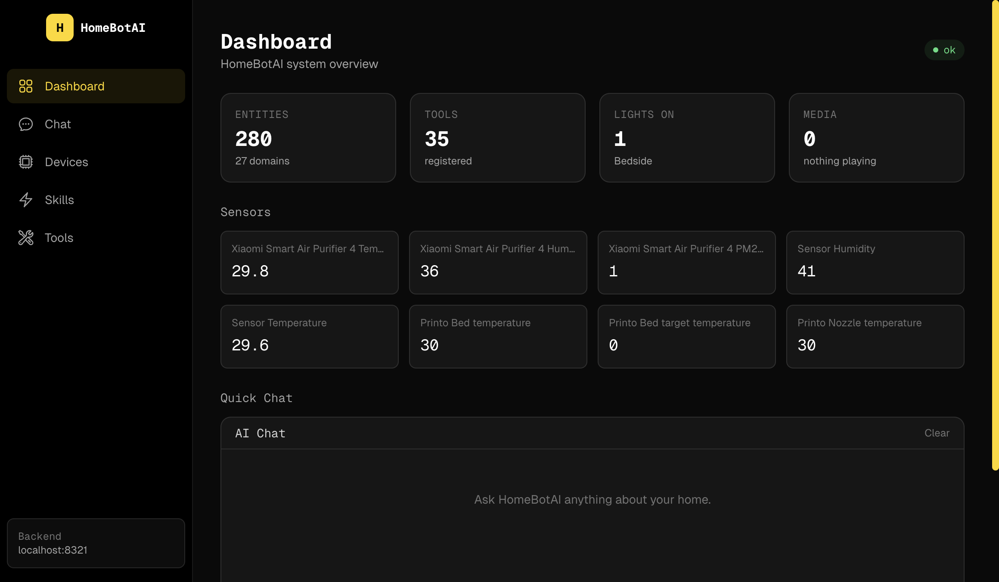
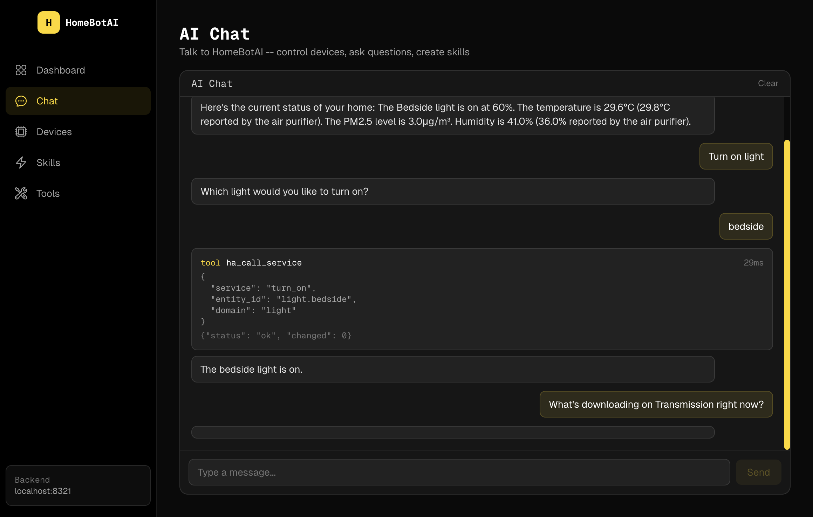

# HomeBotAI

Intelligent smart-home assistant powered by LangChain + Gemini, with live Home Assistant awareness, learnable skills, proactive automations, and a modern dashboard UI.



## Architecture

See [ARCHITECTURE.md](ARCHITECTURE.md) for detailed system design, data flows, and component breakdowns.

## Project Structure

```
homebot/
  backend/          Python AI agent, API, CLI, Telegram bot
  dashboard/        Next.js dashboard UI
  docs/             Screenshots and documentation assets
  README.md         This file
  ARCHITECTURE.md   System architecture docs
```

## Backend

LangChain/LangGraph ReAct agent with three-layer memory (episodic, semantic, procedural) and 35 tools spanning Home Assistant, media services (Sonarr, Transmission, Jellyseerr, Prowlarr, Jellyfin), n8n workflows, and skill management.

Entry points:
- `main.py` -- Telegram bot (production)
- `api.py` -- FastAPI REST API with SSE streaming (default port 8321)
- `cli.py` -- Interactive Rich CLI for development

### Key Features

- **Live HA state** -- WebSocket subscription mirrors 280+ entities in memory; relevance-filtered summary injected into every LLM call
- **35 tools** -- Home Assistant control, Sonarr, Transmission, Jellyseerr, Prowlarr, Jellyfin, n8n, skills, memory
- **Three-layer memory** -- episodic (conversation history), semantic (facts/prefs), procedural (learned skills)
- **Learnable skills** -- teach routines via chat ("When I say goodnight, turn off all lights")
- **Proactive reactor** -- cron schedules and HA state-change triggers
- **LangSmith tracing** -- full observability for every agent run

## Dashboard

Next.js 15 frontend that consumes the backend API. Pure client-side -- no backend logic, no database, no LLM calls.

### Pages

| Page | Screenshot | Description |
|------|-----------|-------------|
| Dashboard |  | System overview -- entity count, active lights, media, sensor readings, quick chat |
| Chat |  | Full-page AI chat with SSE streaming, tool call visibility |
| Devices |  | Browse all 280 HA entities, filter by domain, search |
| Skills |  | View and manage learned routines/automations |
| Tools |  | Reference of all 35 registered tools with descriptions |

### Design System

Dark theme with cyber-yellow accents, Geist Sans/Mono fonts, shared with the portfolio site. Built with Tailwind CSS, Framer Motion animations, and Magic UI components.

## Quick Start

### Backend (local dev)

```bash
cd backend
python3 -m venv ../.venv
source ../.venv/bin/activate
pip install -r requirements.txt
cp .env.example .env   # fill in your tokens
python cli.py           # interactive CLI
python api.py           # REST API on :8321
python main.py          # Telegram bot
```

### Dashboard (local dev)

```bash
cd dashboard
npm install
cp .env.example .env.local   # set NEXT_PUBLIC_API_URL=http://localhost:8321
npm run dev                   # http://localhost:3001
```

### Production build

```bash
cd dashboard
npm run build
npm start -- -p 3001
```

### Docker

```bash
docker compose up -d homebot homebot-dashboard
```

- Backend API: `http://localhost:8321`
- Dashboard: `http://localhost:3001`
- Telegram bot runs automatically inside the backend container

## Environment Variables

### Backend (`backend/.env`)

| Variable | Required | Description |
|----------|----------|-------------|
| `TELEGRAM_BOT_TOKEN` | Yes | Telegram Bot API token |
| `GEMINI_API_KEY` | Yes | Google Gemini API key |
| `GEMINI_MODEL` | No | Model name (default: `gemini-2.5-flash`) |
| `HA_URL` | Yes | Home Assistant URL |
| `HA_TOKEN` | Yes | HA long-lived access token |
| `DB_PATH` | No | SQLite path (default: `./data/homebot.db`) |
| `LANGSMITH_TRACING` | No | Enable LangSmith tracing (`true`) |
| `LANGSMITH_API_KEY` | No | LangSmith API key |
| `LANGSMITH_PROJECT` | No | LangSmith project name |
| `N8N_URL` | No | n8n automation URL |
| `SONARR_URL` | No | Sonarr API URL |
| `SONARR_API_KEY` | No | Sonarr API key |
| `TRANSMISSION_URL` | No | Transmission RPC URL |
| `JELLYSEERR_URL` | No | Jellyseerr API URL |
| `JELLYSEERR_API_KEY` | No | Jellyseerr API key |
| `PROWLARR_URL` | No | Prowlarr API URL |
| `PROWLARR_API_KEY` | No | Prowlarr API key |
| `JELLYFIN_URL` | No | Jellyfin API URL |
| `JELLYFIN_API_KEY` | No | Jellyfin API key |
| `CORS_ORIGINS` | No | Comma-separated allowed origins (default: `http://localhost:3001`) |

### Dashboard (`dashboard/.env.local`)

| Variable | Required | Description |
|----------|----------|-------------|
| `NEXT_PUBLIC_API_URL` | Yes | Backend API base URL (e.g. `http://localhost:8321`) |

## Testing

### Service connectivity tests

```bash
cd backend
python tests/test_services.py                    # all services
python tests/test_services.py transmission       # single service
python tests/test_services.py jellyfin prowlarr  # multiple services
```

### Agent tests

```bash
cd backend
python tests/test_agent.py
```

## API Reference

| Method | Path | Description |
|--------|------|-------------|
| POST | `/api/chat` | Blocking chat -- returns full response + tool calls |
| POST | `/api/chat/stream` | SSE stream of real-time events |
| GET | `/api/health` | System status (tools, entities, model) |
| GET | `/api/tools` | List all registered tools |
| GET | `/api/skills` | List learned skills |
| GET | `/api/entities` | HA entities grouped by domain |

Swagger docs: `http://localhost:8321/docs`
