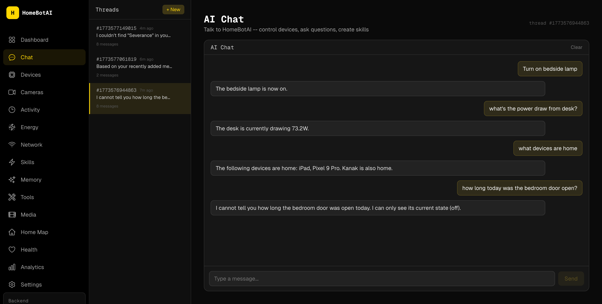
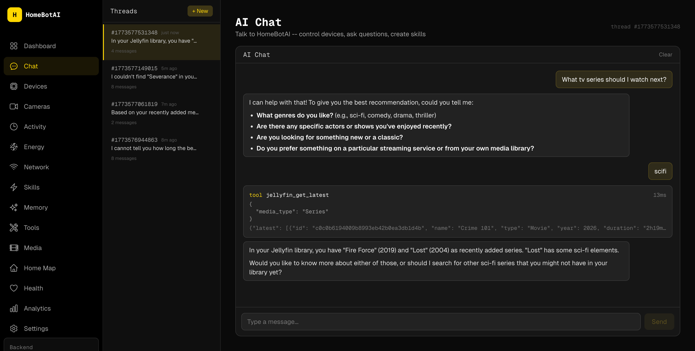
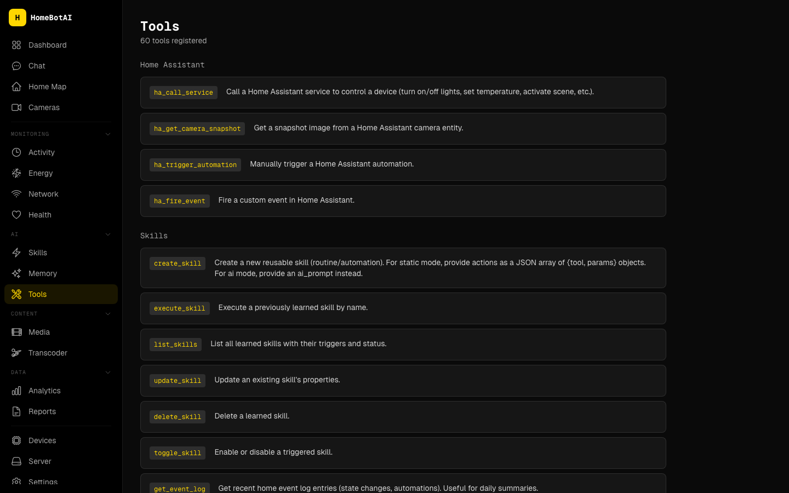
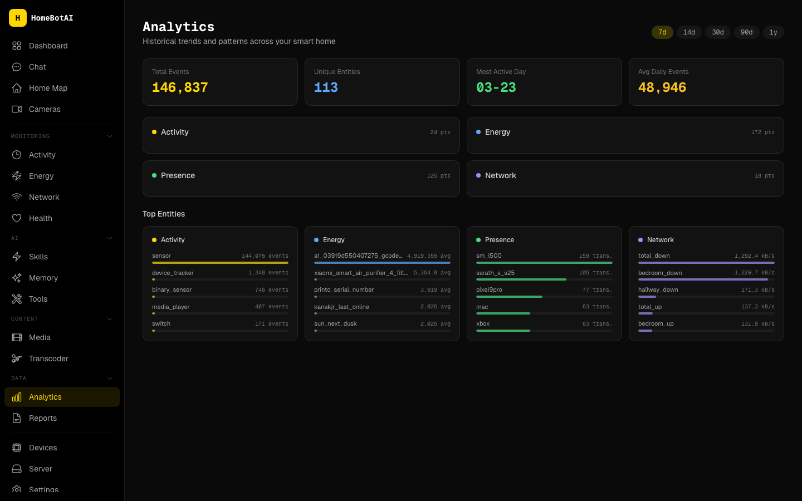
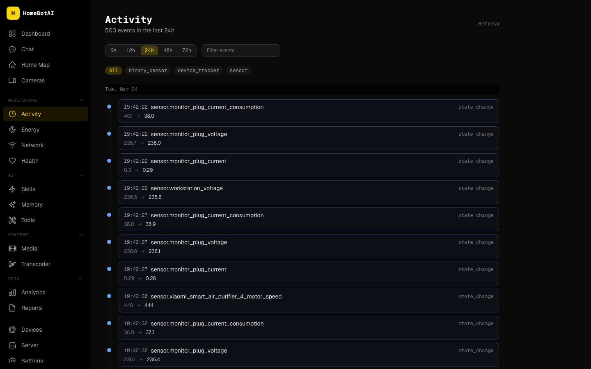
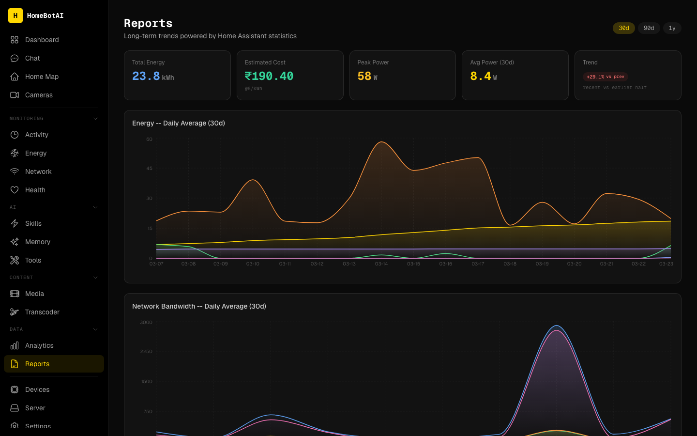

# HomeBotAI

Intelligent smart-home assistant powered by LangChain + Gemini, with live Home Assistant awareness, learnable skills, proactive automations, and a modern dashboard UI.

## Demo video

- [Watch the demo on YouTube](https://youtu.be/og9YRxQFgDE?si=cjp23OfxW1IjFVin)


## Features

### AI-Customizable Dashboard

Widget-based homepage driven by a JSON config. A floating AI assistant (bottom-right) lets you customize the layout via natural language -- add widgets, remove cards, rearrange sections. Changes are persisted in SQLite and survive restarts. Widgets include stat cards, toggle groups, sensor grids, camera previews, scene buttons, and quick actions.

### Natural Language Device Control

Control any Home Assistant device through conversational commands. Set light colors, adjust brightness, toggle switches -- the agent resolves entity names and calls the right HA services automatically, with full tool-call transparency in the chat UI.



### Smart Media Management

Get TV/movie recommendations and manage your media stack through chat. The agent searches Sonarr, Prowlarr, Jellyseerr, and Transmission, finds the right content, and kicks off downloads -- all in a single conversation.



### Sensor Data Analysis

Ask about your home environment and get formatted sensor summaries with AI-powered analysis. The agent reads live HA sensor data and presents it as structured tables with contextual insights on air quality, temperature, humidity, and power consumption.

### Live Camera Snapshots

Dedicated cameras page with live snapshots from all Home Assistant camera entities. Auto-refresh on a 15-second interval, manual snapshot on demand, and streaming status indicators. Ask the agent in chat to show any camera and it renders the snapshot inline.


### Scenes -- State Snapshot and Restore

Snapshot the current state of any set of devices (lights, fans, climate) and restore them with a single command. Scenes capture entity states and attributes (brightness, color temperature, fan mode) and can be activated from the dashboard, the chat agent, or the Home Map. Stored in SQLite for persistence.

### Interactive Home Map

A dedicated floorplan page with an inlined SVG floor plan showing live device states as colored overlays. Lights glow when on, sensors display readings, and devices are clickable for direct toggle control. Configured via a device-to-SVG mapping stored in the database.


### 59 Integrated Tools

Home Assistant control, Sonarr, Radarr, Transmission, Jellyseerr, Prowlarr, Jellyfin, scene management, learnable skills, and three-layer memory -- all accessible via natural language.



### Smart Home Awareness

WebSocket subscription mirrors 307 HA entities in memory. Context-aware state summaries are injected into every LLM call -- mentioning "printer" automatically includes 3D printer telemetry, asking about "batteries" surfaces all device levels, and recent state changes are always visible. The agent detects anomalies (low battery, high power draw, open doors) and flags them proactively.


### Presence Tracking

Device trackers (phones, watches, tablets) and person entities are part of every conversation. The agent knows who's home, which devices are nearby, and can trigger location-based automations.

### Proactive Notifications

Automatic Telegram alerts without asking -- 3D printer finished, battery critically low (<15%), welcome home with lights status, left home with devices still on. Built-in rules with cooldown to prevent spam.

### AI Digests

Scheduled daily and weekly AI-generated summaries sent via Telegram. The daily digest (10 PM) covers activity, energy, and notable events. The weekly report (Sunday 8 PM) analyzes power trends and device usage patterns.

### Energy Dashboard

Track power consumption, energy usage, and battery levels across all your devices. Live power gauges show real-time wattage with color-coded thresholds, area charts visualize consumption over configurable time ranges (6h to 7d), and battery cards surface low devices at a glance. Data comes from HA power/energy/battery sensors and the event log history.


### Network Monitoring

TP-Link Deco mesh status with live bandwidth per node, connected device inventory grouped by access point, and bandwidth-over-time charts. Filter by active/offline devices, see per-client throughput, and track internet connectivity.


### Media Dashboard

Unified media management page -- now playing from Jellyfin, active downloads from Transmission, TV and movie queues from Sonarr/Radarr, library browsing, and Jellyseerr request status. Search across all services from a single search bar.


### Health Tracking

Personal health dashboard pulling data from wearables via Home Assistant. Heart rate monitoring with history charts, daily activity rings (steps, calories, distance, floors), sleep tracking with quality indicators, and device battery levels. Data sourced from Galaxy Watch and Pixel sensors.


### Analytics

Historical trends and patterns across your smart home. Activity frequency, energy consumption over time, presence tracking, and network usage -- all with configurable time ranges (7d, 14d, 30d) and metric selectors.



### Learnable Skills

Teach the agent reusable routines via chat ("When I say goodnight, turn off all lights and set the fan to auto"). Skills are stored as procedural memory and can be triggered by name, cron schedules, or HA state changes.


### Activity Log

Real-time event stream of all HA state changes with domain filtering (camera, device_tracker, sensor, switch) and configurable time windows (6h to 72h). Every entity change is logged with old/new values.



### Settings

Configure notification rules (3D printer done, battery low, welcome/left home, Deco node offline, device disconnect) with per-rule toggles and cooldowns. Manage device aliases for network clients and configure presence tracking devices.


### Widget Builder

AI-powered widget creation for the dashboard. Select entities, describe what you want, and the agent generates interactive widgets using a generative UI system. Drag-and-drop positioning via react-grid-layout with responsive breakpoints.

### Media Discovery

Ollama-powered content recommendations with category filtering. Browse personalized TV, movie, and anime suggestions generated by a local LLM based on your library and preferences.

### Transcoder

HandBrake-based media transcoding with library browsing, job management, and preset configuration. Browse library folders, queue transcoding jobs, and monitor progress from the dashboard.


### Reports

Long-term energy and network data aggregation with configurable time ranges. AI-generated summaries covering consumption patterns, device usage, and trend analysis.



### Server Management

Docker container listing with status monitoring, Cloudflare Tunnel route management for remote access, and backup status tracking. All manageable from the dashboard.


### Local LLM Support

Ollama integration enables local model execution for skill running, dashboard summaries, and media discovery. Configure via OLLAMA_URL and model-specific environment variables. Supports model routing between Google GenAI and Ollama.

### Deep Agent

A standalone LangChain Deep Agent service with 49 tools across 8 modules, running on port 8322. Features SKILL.md-based progressive skill loading and a model policy that routes between cloud and local LLMs. The dashboard chat includes a toggle to switch between the main agent and Deep Agent.

### Voice Assistant (Gemini Live + Jarvis wake word)

A hands-free "Hey Jarvis" voice interface that runs on the Mac mini and turns it into an Alexa-style device for the bedroom. openWakeWord listens locally on a single CPU core for the wake phrase; when it fires, a Gemini Live WebSocket session handles STT, reasoning, and TTS in one low-latency loop. Twelve function-calling tools are exposed directly -- lights, plugs, fans, the Alexa-proxied RGB LED strip, scenes, HA sensor summaries, Jellyfin sessions, Transmission downloads, and session control. Anything more complex (media discovery, Sonarr/Radarr adds, link processing, Obsidian memory) is routed through a single `delegate_to_homebot` tool that calls the Deep Agent's existing `/api/chat/stream` endpoint, so the voice module inherits everything the Deep Agent can do without duplicating it.

Sessions auto-close after 30 s of silence or 13 min elapsed (below the 15 min Gemini Live cap), then the mic goes back to wake-word listening. Context window compression and session resumption are enabled.

**Hardware for a proper Alexa-style setup:** a far-field USB mic with hardware AEC -- the [ReSpeaker XVF3800](https://wiki.seeedstudio.com/respeaker_xvf3800_usb/) is the reference pick (4-mic circular array, ~5 m pickup, on-board beamforming and echo cancellation). Without hardware AEC, Gemini's own output can bleed back into the mic; the session code mutes the mic during model speech as a fallback. Set `MIC_DEVICE_INDEX` in `voice/.env` after running `python -c "import sounddevice as sd; print(sd.query_devices())"`.

**Run it:**

```bash
cd Apps/homebot
source ~/Workspace/set-proxy.sh
pip install -r voice/requirements.txt
cp voice/.env.example voice/.env     # fill in GEMINI_API_KEY, HA_URL, HA_TOKEN, DEEPAGENT_URL
python -m voice                       # or `python -m voice.main`
```

## Architecture


> Regenerate after changes: `./docs/generate-diagrams.sh`

## Documentation

- [ARCHITECTURE.md](ARCHITECTURE.md) -- System design, data flows, and component breakdowns
- [Full Documentation Site](https://kanakjr.github.io/homebot/) -- Comprehensive docs with screenshots, API reference, and feature guides
- [docs/features/ai-dashboard.md](docs/features/ai-dashboard.md) -- AI dashboard widget system
- [docs/features/smart-features.md](docs/features/smart-features.md) -- Presence, notifications, digests
- [docs/roadmap.md](docs/roadmap.md) -- Future roadmap
- [docs/benchmarks.md](docs/benchmarks.md) -- LLM benchmark results

## Project Structure

```
homebot/
  backend/          Python AI agent, API, CLI, Telegram bot
  dashboard/        Next.js dashboard UI
  deepagent/        Standalone Deep Agent service (port 8322)
  voice/            Wake-word + Gemini Live voice assistant (runs on the Mac mini)
  transcoder/       HandBrake transcoding service
  tests/            Backend + LLM benchmark tests
  docs/             MkDocs documentation site source
  README.md         This file
  ARCHITECTURE.md   System architecture overview
  mkdocs.yml        MkDocs Material configuration
```

## Backend

LangChain/LangGraph ReAct agent with three-layer memory and 59 tools spanning Home Assistant, media services (Sonarr, Radarr, Transmission, Jellyseerr, Prowlarr, Jellyfin), scene management, and skill management.

Entry points:
- `main.py` -- Telegram bot (production)
- `api.py` -- FastAPI REST API with SSE streaming (default port 8321)
- `cli.py` -- Interactive Rich CLI for development

## Dashboard

Next.js 15 frontend with dark cyber-yellow theme, Geist Sans/Mono fonts, Tailwind CSS, and Framer Motion animations. Pure client-side -- no backend logic, no database, no LLM calls.

Fully mobile-responsive with slide-out drawer navigation on phones/tablets.

Pages: Dashboard (AI-customizable widget grid with drag-and-drop), Chat (AI conversation with SSE streaming and tool visibility), Devices (HA entities with domain filters), Cameras (live snapshots), Activity (event log), Energy (power/energy charts, battery levels), Network (Deco mesh nodes, connected clients, live bandwidth), Media (unified media management with discovery), Health (wearable health metrics), Analytics (historical trends), Reports (long-term data summaries), Skills and Scenes (learned routines + state snapshots), Memory (semantic facts), Tools (registered tools reference), Home Map (interactive SVG floorplan with live device overlays), Settings (notification rules, device aliases), Server (Docker containers, Cloudflare tunnels, backups), Transcoder (library browser, transcoding jobs).

## Quick Start

### Backend (local dev)

```bash
cd backend
python3 -m venv ../.venv
source ../.venv/bin/activate
pip install -r requirements.txt
cp .env.example .env   # fill in your tokens
python cli.py           # interactive CLI
python api.py           # REST API on :8321
python main.py          # Telegram bot
```

### Dashboard (local dev)

```bash
cd dashboard
npm install
cp .env.example .env.local   # set NEXT_PUBLIC_API_URL=http://localhost:8321
npm run dev                   # http://localhost:3001
```

### Production build

```bash
cd dashboard
npm run build
npm start -- -p 3001
```

### Docker

```bash
docker compose up -d homebot homebot-dashboard homebot-deepagent transcoder
```

- Backend API: `http://localhost:8321`
- Dashboard: `http://localhost:3001`
- Deep Agent API: `http://localhost:8322`
- Telegram bot runs automatically inside the backend container

## Environment Variables

### Backend (`backend/.env`)

| Variable | Required | Description |
|----------|----------|-------------|
| `TELEGRAM_BOT_TOKEN` | Yes | Telegram Bot API token |
| `GEMINI_API_KEY` | Yes | Google Gemini API key |
| `GEMINI_MODEL` | No | Model name (default: `gemini-2.5-flash`) |
| `HA_URL` | Yes | Home Assistant URL |
| `HA_TOKEN` | Yes | HA long-lived access token |
| `DB_PATH` | No | SQLite path (default: `./data/homebot.db`) |
| `LANGSMITH_TRACING` | No | Enable LangSmith tracing (`true`) |
| `LANGSMITH_API_KEY` | No | LangSmith API key |
| `LANGSMITH_PROJECT` | No | LangSmith project name |
| `SONARR_URL` | No | Sonarr API URL |
| `SONARR_API_KEY` | No | Sonarr API key |
| `TRANSMISSION_URL` | No | Transmission RPC URL |
| `JELLYSEERR_URL` | No | Jellyseerr API URL |
| `JELLYSEERR_API_KEY` | No | Jellyseerr API key |
| `PROWLARR_URL` | No | Prowlarr API URL |
| `PROWLARR_API_KEY` | No | Prowlarr API key |
| `JELLYFIN_URL` | No | Jellyfin API URL |
| `JELLYFIN_API_KEY` | No | Jellyfin API key |
| `OLLAMA_URL` | No | Ollama API URL (default: `http://127.0.0.1:11434`) |
| `OLLAMA_MODEL` | No | Default Ollama model for local inference |
| `MEDIA_DISCOVERY_MODEL` | No | Ollama model for media discovery |
| `RADARR_URL` | No | Radarr API URL |
| `RADARR_API_KEY` | No | Radarr API key |
| `CORS_ORIGINS` | No | Comma-separated allowed origins (default: `http://localhost:3001`) |
| `ENERGY_RATE` | No | Electricity cost per kWh (default: `8`) |
| `ENERGY_CURRENCY` | No | Currency code for energy cost (default: `INR`) |

### Dashboard (`dashboard/.env.local`)

| Variable | Required | Description |
|----------|----------|-------------|
| `NEXT_PUBLIC_API_URL` | Yes | Backend API base URL (e.g. `http://localhost:8321`) |

## Testing

### Service connectivity tests

```bash
python tests/backend/test_services.py                    # all services
python tests/backend/test_services.py transmission       # single service
python tests/backend/test_services.py jellyfin prowlarr  # multiple services
```

### Agent tests

```bash
python tests/backend/test_agent.py
```

### LLM benchmarks

```bash
python tests/llm/test_benchmark.py
python tests/llm/test_tool_calling.py
```

## API Reference

| Method | Path | Description |
|--------|------|-------------|
| POST | `/api/chat` | Blocking chat -- returns full response + tool calls |
| POST | `/api/chat/stream` | SSE stream of real-time events |
| GET | `/api/chat/threads` | List conversation threads |
| GET | `/api/chat/{id}/history` | Get message history for a thread |
| DELETE | `/api/chat/{id}/history` | Clear a thread's history |
| GET | `/api/health` | System status (tools, entities, model) |
| GET | `/api/health/data` | Health metrics time series |
| GET | `/api/models` | Available LLM models |
| GET | `/api/tools` | List all registered tools |
| GET | `/api/skills` | List learned skills |
| POST | `/api/skills` | Create a new skill |
| PUT | `/api/skills/{id}` | Update a skill |
| DELETE | `/api/skills/{id}` | Delete a skill |
| POST | `/api/skills/{id}/toggle` | Enable/disable a skill |
| POST | `/api/skills/{id}/execute` | Execute a skill on demand |
| GET | `/api/entities` | HA entities grouped by domain |
| POST | `/api/entities/{id}/toggle` | Toggle a switch/light/fan/scene entity |
| POST | `/api/entities/{id}/light` | Set light brightness, color, temperature |
| POST | `/api/entities/{id}/climate` | Set climate preset, fan mode, temperature |
| GET | `/api/events` | Event log with time filtering |
| GET | `/api/memory` | Semantic memory facts |
| POST | `/api/memory` | Store a memory fact |
| DELETE | `/api/memory/{key}` | Delete a memory fact |
| POST | `/api/cameras/{id}/snapshot` | Request a camera snapshot |
| GET | `/api/snapshots/{filename}` | Serve a saved snapshot image |
| GET | `/api/dashboard` | Dashboard widget config |
| PUT | `/api/dashboard` | Save dashboard config |
| POST | `/api/dashboard/edit` | AI-edit dashboard layout via natural language |
| GET | `/api/dashboard/summary` | AI-generated home summary |
| POST | `/api/generate-widget` | Generate widget JSON spec from entities |
| POST | `/api/suggest-widget` | Suggest widget title/description |
| GET | `/api/network` | Network status: mesh nodes, clients, bandwidth |
| GET | `/api/energy` | Energy sensors + historical power data |
| GET | `/api/analytics` | Historical analytics (energy, presence, network) |
| GET | `/api/media/overview` | Media overview (now playing, downloads, queues) |
| GET | `/api/media/search` | Search across all media services |
| GET | `/api/media/downloads` | Active downloads from Transmission |
| POST | `/api/media/downloads/{id}/action` | Pause/resume/remove a download |
| GET | `/api/media/tv` | TV series from Sonarr |
| GET | `/api/media/movies` | Movies from Radarr |
| GET | `/api/media/library` | Jellyfin library contents |
| GET | `/api/media/requests` | Jellyseerr media requests |
| GET | `/api/media/discover` | AI-powered media discovery |
| GET | `/api/server/containers` | Docker container listing |
| GET | `/api/server/tunnel` | Cloudflare Tunnel routes |
| POST | `/api/server/tunnel` | Add a tunnel route |
| DELETE | `/api/server/tunnel/{subdomain}` | Remove a tunnel route |
| GET | `/api/server/backups` | Backup status |
| GET | `/api/reports/summary` | Long-term report summaries |
| GET | `/api/scenes` | List saved scenes |
| POST | `/api/scenes` | Create a scene (snapshot entity states) |
| POST | `/api/scenes/{id}/activate` | Restore a scene's saved states |
| DELETE | `/api/scenes/{id}` | Delete a scene |
| GET | `/api/floorplan/config` | Floorplan device-to-SVG mapping |
| PUT | `/api/floorplan/config` | Update floorplan config |
| GET | `/api/devices/aliases` | Device name aliases |
| PUT | `/api/devices/aliases/{mac}` | Set a device alias |
| DELETE | `/api/devices/aliases/{mac}` | Delete a device alias |
| GET | `/api/notifications/rules` | Notification rule configs |
| PUT | `/api/notifications/rules/{id}` | Update a notification rule |

~65 endpoints total. Swagger docs: `http://localhost:8321/docs`
