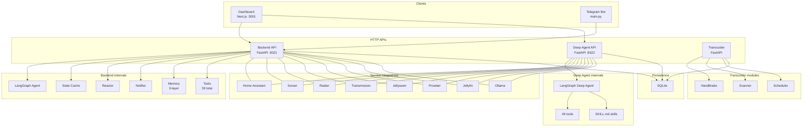
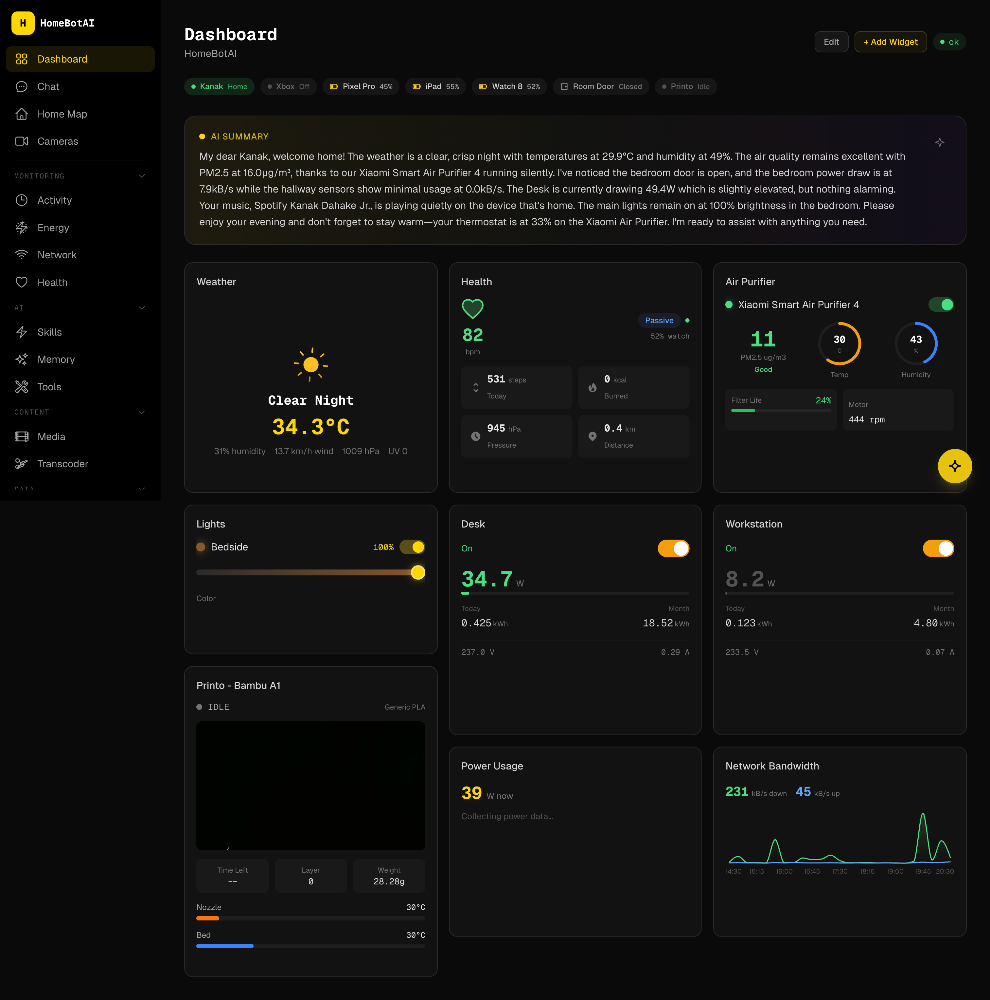
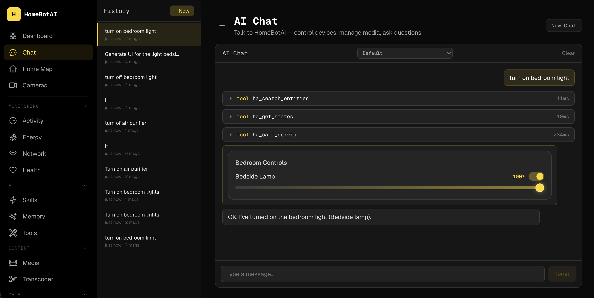
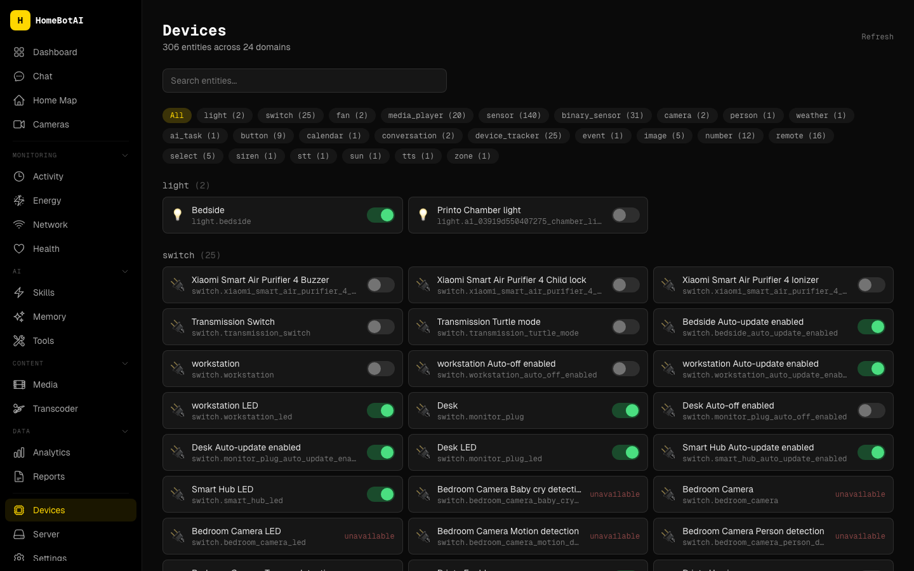

# HomeBotAI -- System Architecture

This document describes the full architecture of **HomeBotAI**: the FastAPI backend, LangGraph agent, three-layer memory, tooling surface, Next.js dashboard, Deep Agent service, and transcoder. It is written for operators and contributors who need a mental model of how components connect and where to change behavior.

!!! tip "How to read this page"
    Use the table of contents for navigation. Mermaid diagrams render in the browser when MkDocs Material and the Mermaid extension are enabled. Collapsible sections group API routes by domain to keep the reference scannable.

---

## 1. System overview

HomeBotAI is a multi-service stack: a primary **Backend API** (agent, memory, tools, Home Assistant integration), a **Dashboard** for operators, a **Telegram** entry point, a **Deep Agent** API for specialized long-running tasks, and a **Transcoder** for media jobs. **SQLite** backs persistence for chat history, semantic facts, skills, and dashboard configuration.



!!! note "Ports and roles"
    The dashboard talks to the Backend on **8321** and the Deep Agent on **8322** for different workloads. The Telegram bot uses the Backend only. The Transcoder exposes its own FastAPI surface for library browsing and job control.

---

## 2. Backend

### Entry points

| Entry point | File      | Purpose              | Transport        |
|-------------|-----------|----------------------|------------------|
| Telegram    | `main.py` | Production chat      | Long polling     |
| API         | `api.py`  | REST + SSE (dashboard) | HTTP (`:8321`) |
| CLI         | `cli.py`  | Developer REPL       | stdin / stdout   |

### Application bootstrap

`bootstrap.py` exposes `create_app()`, which:

- Initializes **memory stores** (episodic, semantic, procedural)
- **Registers all tools** bound to the runtime configuration
- Builds the **LangGraph** agent graph used by chat and API
- Connects the **Home Assistant WebSocket** for live entity state

!!! warning "Single source of wiring"
    Most cross-cutting setup lives in `create_app()` so tests and alternate entry points (CLI, scripts) share the same initialization path as production.

---

## 3. Agent (`agent.py`)

| Concern | Implementation |
|---------|----------------|
| **Primary model** | `gemini-2.5-flash` via `langchain-google-genai` |
| **Fallback** | Ollama routing through `llm.py` and `model_policy.py` |
| **Orchestration** | `langgraph.prebuilt.create_react_agent` (ReAct loop) |
| **System prompt** | Built per request: live HA state, learned skills, semantic memory |
| **State summary** | Relevance-filtered: active lights, climate, playing media, anomalies |
| **History** | Last **10** conversation turns from episodic memory |
| **Streaming** | `run_stream()` yields typed events: `thinking`, `tool_call`, `tool_result`, `response`, `error` |

The agent is the interactive brain of the Backend: tool calls are explicit steps in the ReAct loop, and streaming events let the dashboard and Telegram render progress without blocking on the full completion.

---

## 4. Memory (three layers)

| Layer      | Purpose                         | Storage              | Lifecycle                    |
|------------|---------------------------------|----------------------|------------------------------|
| Episodic   | Chat history                    | SQLite, per `chat_id` | Auto-trimmed to **50** turns |
| Semantic   | User preferences, stable facts  | SQLite key-value     | Persistent                   |
| Procedural | Skills, routines, automation    | SQLite + event log   | User-managed                 |

Episodic memory feeds short conversational context; semantic memory grounds preferences across sessions; procedural memory ties user-defined skills and reactor triggers to durable records.

---

## 5. Tools (59 registered in backend)

Tools are Python-callable capabilities registered at bootstrap. The table below lists categories, counts, tool names, and source modules.

| Category        | Count | Tools | Source |
|-----------------|------:|-------|--------|
| Home Assistant  | 4 | `ha_call_service`, `ha_get_camera_snapshot`, `ha_trigger_automation`, `ha_fire_event` | `tools/homeassistant.py` |
| Skills          | 7 | `create_skill`, `execute_skill`, `list_skills`, `update_skill`, `delete_skill`, `toggle_skill`, `get_event_log` | `tools/skills.py` |
| Memory          | 2 | `remember`, `recall` | `tools/memory_tools.py` |
| Scenes          | 3 | `create_scene`, `activate_scene`, `delete_scene` | `tools/scenes.py` |
| Sonarr          | 8 | `sonarr_search`, `sonarr_add_series`, `sonarr_get_queue`, `sonarr_get_series`, `sonarr_get_calendar`, `sonarr_delete_series`, `sonarr_episode_search`, `sonarr_get_history` | `tools/sonarr.py` |
| Radarr          | 8 | `radarr_search`, `radarr_add_movie`, `radarr_get_queue`, `radarr_get_movies`, `radarr_get_calendar`, `radarr_delete_movie`, `radarr_movie_search`, `radarr_get_history` | `tools/radarr.py` |
| Transmission    | 8 | `transmission_get_torrents`, `transmission_add_torrent`, `transmission_pause_resume`, `transmission_remove_torrent`, `transmission_set_alt_speed`, `transmission_get_session_stats`, `transmission_set_priority`, `transmission_get_free_space` | `tools/transmission.py` |
| Jellyseerr      | 5 | `jellyseerr_search`, `jellyseerr_request`, `jellyseerr_get_requests`, `jellyseerr_approve_decline`, `jellyseerr_get_request_status` | `tools/jellyseerr.py` |
| Prowlarr        | 5 | `prowlarr_search`, `prowlarr_get_indexers`, `prowlarr_get_indexer_stats`, `prowlarr_grab_release`, `prowlarr_get_health` | `tools/prowlarr.py` |
| Jellyfin        | 9 | `jellyfin_search`, `jellyfin_get_libraries`, `jellyfin_get_latest`, `jellyfin_get_sessions`, `jellyfin_system_info`, `jellyfin_playback_control`, `jellyfin_mark_played`, `jellyfin_get_item_details`, `jellyfin_get_resume` | `tools/jellyfin.py` |

---

## 6. State cache (`state.py`)

The state cache maintains a **live in-memory mirror** of Home Assistant entities, updated over the HA WebSocket connection.

| Behavior | Description |
|----------|-------------|
| **Summary injection** | A relevance-filtered summary is injected into the system prompt |
| **Context-aware filtering** | Mentioning e.g. **printer** surfaces 3D printer telemetry without dumping every entity |
| **Recent changes** | Tracks recent entity transitions for conversational grounding |
| **Anomalies** | Highlights unusual readings or states for the agent to reason about |

This layer decouples raw HA state volume from what the model actually sees each turn.

---

## 7. Reactor (`reactor.py`)

The reactor is the **proactive automation engine** running alongside the conversational agent.

| Trigger type | Mechanism |
|----------------|-----------|
| **Schedule** | Cron-style schedules via **APScheduler** |
| **State change** | Home Assistant entity transitions |
| **Skills** | User-defined skills declare triggers the reactor monitors |

Skills can therefore fire on time, on HA changes, or both, without requiring an open chat session.

---

## 8. Notifier (`notifier.py`)

The notifier sends **proactive Telegram messages** based on rules, for example:

- Printer job finished
- Battery low (threshold **under 15%**)
- Welcome home / left home style presence transitions

A **5-minute cooldown per entity** reduces duplicate alerts when state flutters.

---

## 9. LLM module (`llm.py`)

`llm.py` provides a **provider abstraction** over:

- **Google GenAI** (primary path for the main agent and many features)
- **Ollama** (local and fallback routing)

Model resolution follows configuration and `model_policy.py`. The same stack supports **skill execution**, **dashboard summaries**, and **media discovery** flows that need text generation outside the main chat graph.

---

## 10. API endpoints (65+ routes)

Routes are grouped below by domain. Expand a section to scan methods and paths quickly.

??? "Chat endpoints"

    | Method | Path |
    |--------|------|
    | `POST` | `/api/chat` |
    | `POST` | `/api/chat/stream` |
    | `GET` | `/api/chat/threads` |
    | `GET` | `/api/chat/{id}/history` |
    | `DELETE` | `/api/chat/{id}/history` |

??? "Health"

    | Method | Path |
    |--------|------|
    | `GET` | `/api/health` |
    | `GET` | `/api/health/data` |

??? "Models"

    | Method | Path |
    |--------|------|
    | `GET` | `/api/models` |

??? "Tools"

    | Method | Path |
    |--------|------|
    | `GET` | `/api/tools` |

??? "Skills"

    | Method | Path |
    |--------|------|
    | `GET` | `/api/skills` |
    | `POST` | `/api/skills` |
    | `GET` | `/api/skills/{id}` |
    | `PUT` | `/api/skills/{id}` |
    | `DELETE` | `/api/skills/{id}` |
    | `POST` | `/api/skills/{id}/toggle` |
    | `POST` | `/api/skills/{id}/execute` |

??? "Entities"

    | Method | Path |
    |--------|------|
    | `GET` | `/api/entities` |
    | `POST` | `/api/entities/{id}/toggle` |
    | `POST` | `/api/entities/{id}/light` |
    | `POST` | `/api/entities/{id}/climate` |

??? "Events"

    | Method | Path |
    |--------|------|
    | `GET` | `/api/events` |

??? "Memory"

    | Method | Path |
    |--------|------|
    | `GET` | `/api/memory` |
    | `POST` | `/api/memory` |
    | `DELETE` | `/api/memory/{key}` |

??? "Cameras"

    | Method | Path |
    |--------|------|
    | `POST` | `/api/cameras/{id}/snapshot` |
    | `GET` | `/api/snapshots/{filename}` |

??? "Dashboard"

    | Method | Path |
    |--------|------|
    | `GET` | `/api/dashboard` |
    | `PUT` | `/api/dashboard` |
    | `POST` | `/api/dashboard/edit` |
    | `GET` | `/api/dashboard/summary` |
    | `POST` | `/api/generate-widget` |
    | `POST` | `/api/suggest-widget` |

??? "Network"

    | Method | Path |
    |--------|------|
    | `GET` | `/api/network` |

??? "Energy"

    | Method | Path |
    |--------|------|
    | `GET` | `/api/energy` |

??? "Analytics"

    | Method | Path |
    |--------|------|
    | `GET` | `/api/analytics` |

??? "Reports"

    | Method | Path |
    |--------|------|
    | `GET` | `/api/reports/summary` |

??? "Scenes"

    | Method | Path |
    |--------|------|
    | `GET` | `/api/scenes` |
    | `POST` | `/api/scenes` |
    | `POST` | `/api/scenes/{id}/activate` |
    | `DELETE` | `/api/scenes/{id}` |

??? "Floorplan"

    | Method | Path |
    |--------|------|
    | `GET` | `/api/floorplan/config` |
    | `PUT` | `/api/floorplan/config` |

??? "Device aliases"

    | Method | Path |
    |--------|------|
    | `GET` | `/api/devices/aliases` |
    | `PUT` | `/api/devices/aliases/{mac}` |
    | `DELETE` | `/api/devices/aliases/{mac}` |

??? "Notifications"

    | Method | Path |
    |--------|------|
    | `GET` | `/api/notifications/rules` |
    | `PUT` | `/api/notifications/rules/{id}` |

??? "Media"

    | Method | Path |
    |--------|------|
    | `GET` | `/api/media/overview` |
    | `GET` | `/api/media/search` |
    | `GET` | `/api/media/downloads` |
    | `POST` | `/api/media/downloads/{id}/action` |
    | `GET` | `/api/media/tv` |
    | `GET` | `/api/media/movies` |
    | `GET` | `/api/media/library` |
    | `GET` | `/api/media/requests` |
    | `GET` | `/api/media/discover` |

??? "Server"

    | Method | Path |
    |--------|------|
    | `GET` | `/api/server/containers` |
    | `GET` | `/api/server/tunnel` |
    | `POST` | `/api/server/tunnel` |
    | `DELETE` | `/api/server/tunnel/{subdomain}` |
    | `GET` | `/api/server/backups` |

---

## 11. Dashboard (18 pages)

The dashboard is a **Next.js** application on port **3001** in development; in Docker it is typically mapped from container port 3000.

| Route | Purpose | Screenshot asset |
|-------|---------|------------------|
| `/` | Dashboard -- AI-customizable widget grid | `assets/screenshots/dashboard.png` |
| `/chat` | AI conversation with SSE streaming | `assets/screenshots/chat.png` |
| `/devices` | Entity browser with domain filters | `assets/screenshots/devices.png` |
| `/cameras` | Live camera snapshots | `assets/screenshots/cameras.png` |
| `/activity` | Real-time event stream | `assets/screenshots/activity.png` |
| `/energy` | Power and energy charts, battery levels | `assets/screenshots/energy.png` |
| `/network` | Mesh nodes, clients, bandwidth | `assets/screenshots/network.png` |
| `/media` | Unified media management | `assets/screenshots/media.png` |
| `/health` | Wearable health metrics | `assets/screenshots/health.png` |
| `/analytics` | Historical trends | `assets/screenshots/analytics.png` |
| `/reports` | Long-term data summaries | `assets/screenshots/reports.png` |
| `/skills` | Skill manager with triggers | `assets/screenshots/skills.png` |
| `/home-map` | Interactive SVG floorplan | `assets/screenshots/home-map.png` |
| `/memory` | Semantic memory facts | `assets/screenshots/memory.png` |
| `/tools` | Tool reference by category | `assets/screenshots/tools.png` |
| `/settings` | Notification rules, aliases | `assets/screenshots/settings.png` |
| `/server` | Docker, Cloudflare tunnel, backups | `assets/screenshots/server.png` |
| `/transcoder` | Library browser, transcode jobs | `assets/screenshots/transcoder.png` |

### Screenshot references (key pages)

Images are resolved relative to the docs root (`docs/`). Place files under `docs/assets/screenshots/`.







---

## 12. Widget system

| Aspect | Detail |
|--------|--------|
| **Component count** | **19** widget types |
| **Rendering** | `DashboardRenderer` renders from **JSON** dashboard configuration |
| **AI creation** | `WidgetBuilder` assists AI-powered widget creation |
| **Editing** | `WidgetEditModal` for in-place edits |
| **Generative UI** | Catalog and registry: `catalog.ts`, `registry.tsx`, `GenUIRenderer.tsx` |
| **Layout** | `react-grid-layout` for drag-and-drop and responsive grids |

**Widget types:** `AiSummaryBanner`, `AirPurifier`, `BandwidthChart`, `Camera`, `ClimateControl`, `Gauge`, `Health`, `LightControl`, `PowerChart`, `Presence`, `Printer`, `QuickActions`, `RoomEnvironment`, `SceneButtons`, `SensorGrid`, `SmartPlug`, `Stat`, `ToggleGroup`, `WeatherCard`, `Weather`.

---

## 13. Frontend architecture

### Tech stack

| Layer | Choice |
|-------|--------|
| Framework | Next.js 15 |
| Language | TypeScript |
| Styling | Tailwind CSS |
| Motion | Framer Motion |
| Grid layout | react-grid-layout |

### Key file tree (representative)

```text
dashboard/
├── app/                    # App Router pages and layouts
├── components/
│   ├── dashboard/          # DashboardRenderer, widgets, modals
│   ├── chat/               # SSE chat UI
│   └── ...
├── lib/
│   ├── api.ts              # fetchJSON, SSE helpers
│   └── hooks/              # useChat, useEntities, etc.
├── widgets/
│   ├── catalog.ts          # Widget metadata for AI / builder
│   ├── registry.tsx        # Component registry
│   └── GenUIRenderer.tsx   # Generative UI bridge
└── public/
```

The frontend treats the Backend as the single source of truth for entities, memory, and skills, while the Deep Agent is invoked for workloads that need the separate tool surface and skills bundle.

---

## 14. Deep Agent

The **Deep Agent** is a **standalone FastAPI** service on port **8322**. It uses the **LangChain Deep Agents** architecture with a dedicated LangGraph graph.

| Aspect | Detail |
|--------|--------|
| **Port** | `8322` |
| **Tools** | **49** tools across **8** modules |
| **Modules** | Home Assistant (5), Sonarr (8), Radarr (8), Jellyfin (9), Transmission (8), Jellyseerr (5), Prowlarr (5), `render_ui` (1) |
| **Skills** | `SKILL.md` skills: device-control, media-management, energy-insights, network-diagnostics |
| **Routing** | Model policy selects **Ollama** vs **Google GenAI** per configuration |

The dashboard can call this service in parallel with the main Backend when a task benefits from the Deep Agent toolpack and skill documents.

---

## 15. Transcoder

The transcoder is a **HandBrake-based** service for batch and on-demand transcoding.

| Module | Role |
|--------|------|
| `transcoder.py` | Core encode pipeline and job orchestration |
| `api.py` | FastAPI HTTP surface |
| `db.py` | SQLite persistence for jobs and metadata |
| `scanner.py` | Library scanning and inventory |
| `scheduler.py` | Scheduled transcode jobs |
| `config.py` | Service configuration |

The dashboard `/transcoder` page talks to this service for library browsing and job control; HandBrake runs as the actual encoder backend.

---

## 16. Docker deployment

Typical Compose-style service definitions:

```yaml
homebot:
  build: ./backend
  ports: ["8321:8321"]

homebot-dashboard:
  build: ./dashboard
  ports: ["3001:3000"]

homebot-deepagent:
  build: ./deepagent
  ports: ["8322:8322"]

transcoder:
  build: ./transcoder
```

Adjust image names, networks, volumes, and environment files to match your host. SQLite files and media libraries should live on **persistent volumes** where noted in your deployment docs.

---

## Related documentation

- [Deep Agent](deep-agent.md) -- focused guide to the 8322 service
- [Transcoder](transcoder.md) -- encoding and scheduling details
- [API Reference](api-reference.md) -- request and response shapes
