---
hide:
  - toc
---

# HomeBotAI

<p class="lead">
An intelligent smart-home assistant powered by <strong>LangChain</strong> and <strong>Gemini</strong>, with live Home Assistant awareness, learnable skills, proactive automations, and a modern dashboard UI that turns telemetry, media, and infrastructure into one coherent command surface.
</p>

{ .shadow }

!!! tip "Why HomeBotAI"
    It unifies conversational control, observability, and automation: the same brain that answers natural-language questions can trigger routines, summarize your home, and surface cameras, energy, and network state without hopping between apps.

---

## Feature gallery

Explore the surfaces HomeBotAI ships today: configurable dashboards, deep integrations, and automation primitives designed for a self-hosted stack.

<div class="grid cards" markdown>

-   **AI-customizable dashboard**

    

    Arrange a responsive widget grid with drag-and-drop placement while the assistant stays one click away for edits, questions, and quick actions. The layout persists per device so phones and wall panels each keep a tuned view.

-   **Natural language control**

    

    Direct lights, climate, and entities through conversation with tool-call transparency so you can see what ran, when, and why. The model stays grounded in live Home Assistant state instead of guessing from memory alone.

-   **Smart media management**

    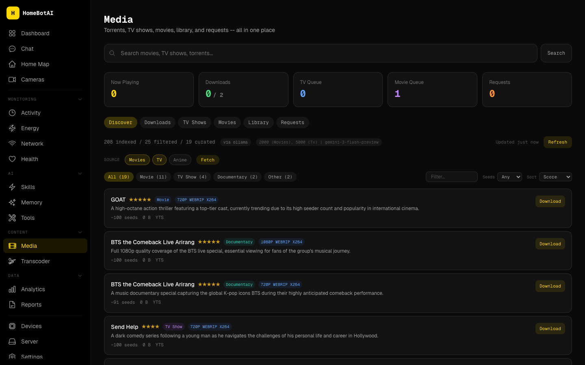

    Track and drive a unified pipeline across Sonarr, Radarr, Jellyfin, Transmission, Jellyseerr, and Prowlarr from one operational picture. Queue health, grab status, and playback context land in the same UI you use for the rest of your home.

-   **Energy dashboard**

    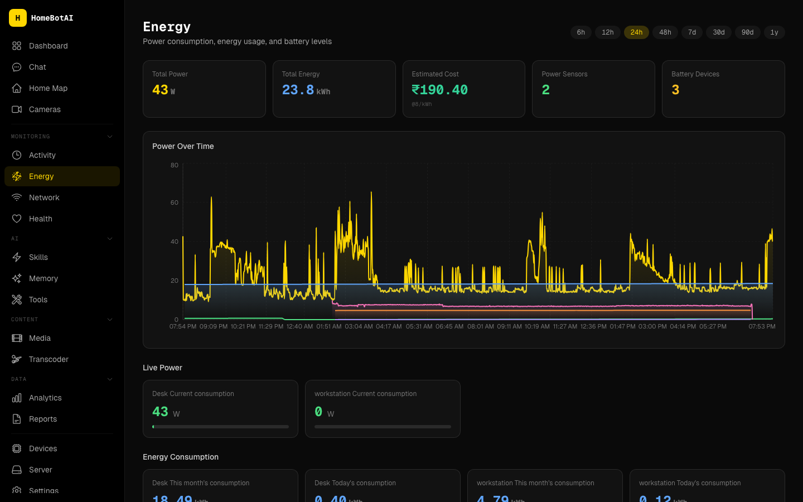

    Monitor real-time power draw, historical trends, and battery levels for solar or UPS-backed setups. Charts make anomalies obvious before they become outages or surprise utility bills.

-   **Network monitoring**

    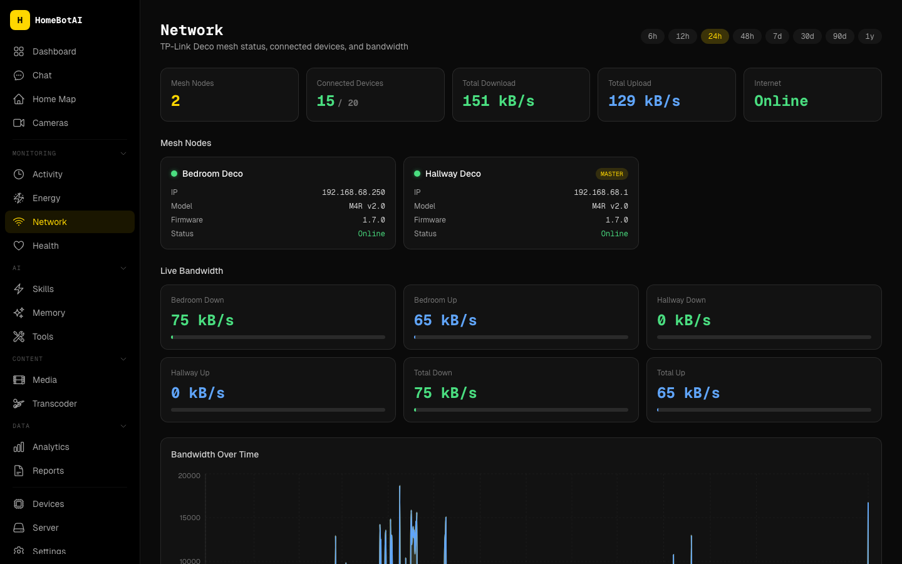

    Visualize mesh nodes, connected clients, and bandwidth so you can spot congestion, rogue devices, or offline access points quickly. It complements Home Assistant with a networking lens purpose-built for home operators.

-   **Health tracking**

    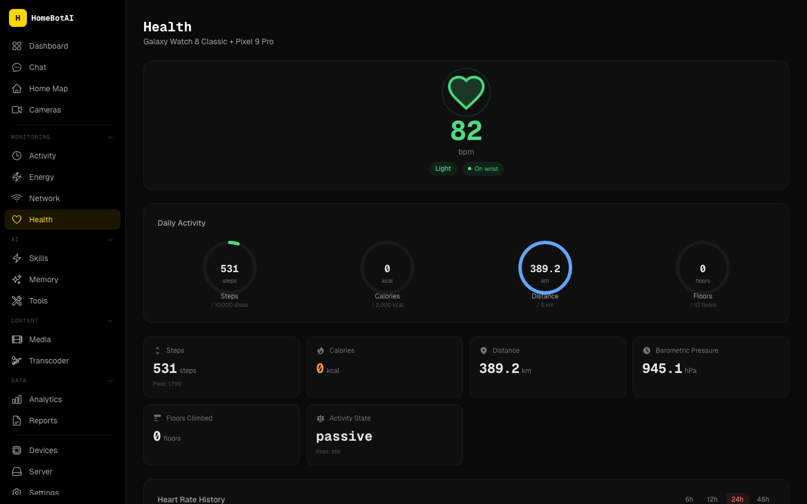

    Bring wearable summaries, activity rings, and heart-rate trends alongside home context for a single glance at how you and your environment are doing. Ideal for dashboards that mix personal and household telemetry.

-   **Interactive home map**

    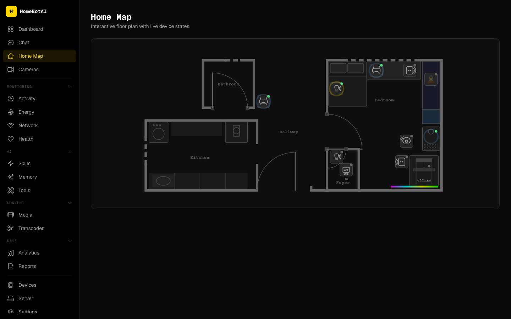

    Navigate an SVG floorplan with live device overlays that reflect entity state in place. Spatial UI beats long entity lists when you are debugging coverage, motion, or room-level scenes.

-   **Learnable skills**

    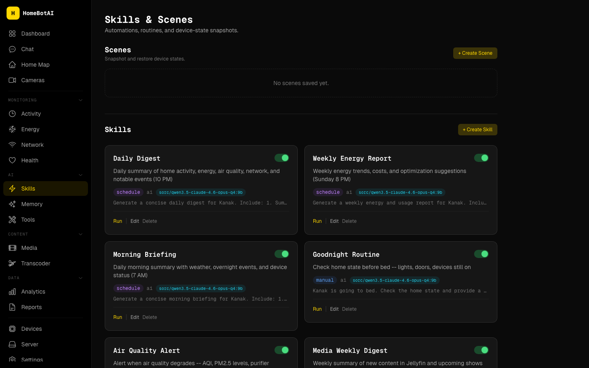

    Teach repeatable routines through chat and bind them to cron schedules or state triggers without maintaining brittle YAML by hand. Skills become shareable, reviewable automation units the assistant can refine over time.

-   **Widget builder**

    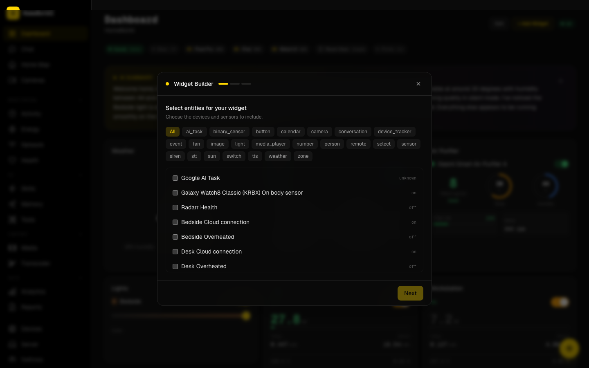

    Select entities and let the assistant generate dashboard widgets using generative UI patterns that match your data types. You iterate in plain language instead of hand-authoring component props for every new sensor.

-   **Media discovery**

    

    Surface what to watch next with Ollama-powered recommendations grounded in your library and habits. It keeps discovery local and aligned with what you actually own and prefer.

-   **Transcoder**

    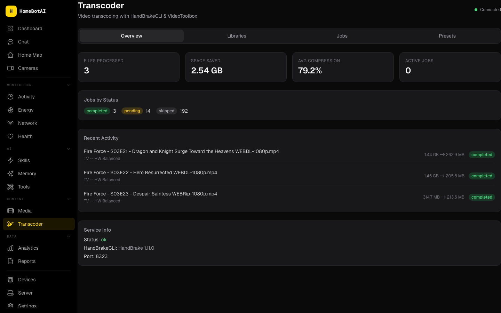

    Queue HandBrake-driven transcoding jobs against your media library with progress surfaced in the same console as acquisition and playback. Normalize formats for clients that dislike certain codecs or bitrates.

-   **Server management**

    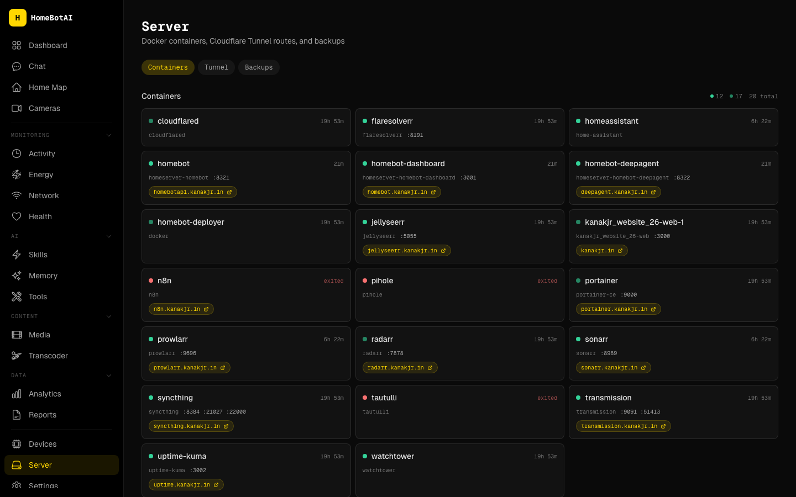

    Inspect Docker containers, Cloudflare tunnels, and backup posture without SSHing host-by-host. The goal is operational confidence: what is running, how it is exposed, and whether recovery paths look sane.

-   **Proactive notifications**

    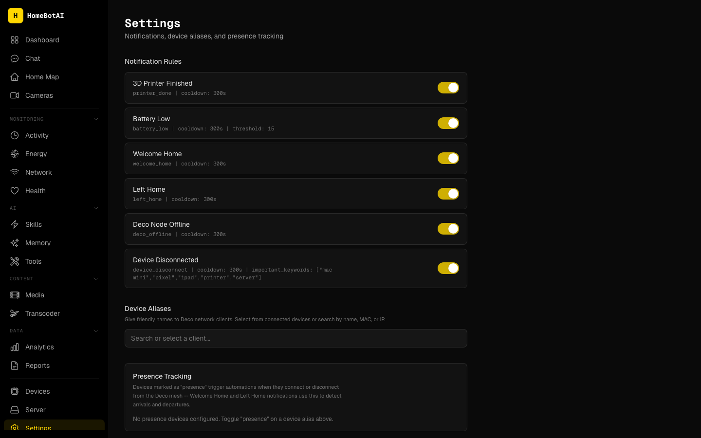

    Receive Telegram alerts for printer jobs finishing, batteries running low, or welcome-home sequences after geofenced arrival. Proactive pushes beat polling dashboards when timing matters.

-   **AI digests**

    

    Schedule daily or weekly AI digests that summarize notable events, anomalies, and trends straight to Telegram. It is executive briefing mode for a home lab or busy household.

-   **Live camera snapshots**

    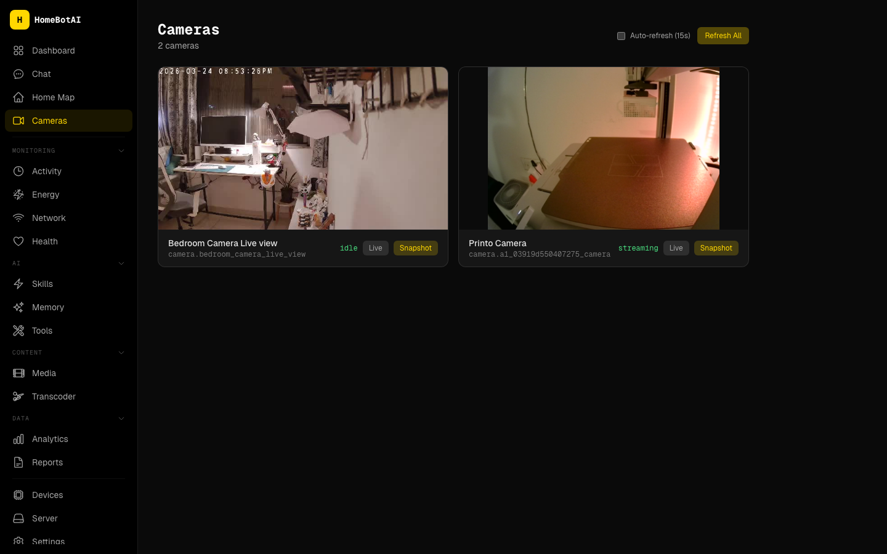

    Auto-refresh camera tiles for situational awareness and capture stills on demand when you need evidence or a quick visual check. Latency-friendly defaults keep feeds useful without melting your CPU.

-   **Local LLM support**

    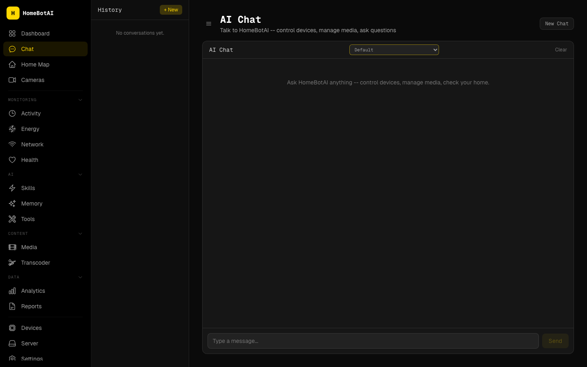

    Run compatible workloads through Ollama for local inference when you want offline or privacy-preserving paths. Swap models without redesigning skills as long as the tool contracts stay stable.

</div>

---

## Quick start

Get a minimal stack online in minutes. Pick the path that matches how you deploy the rest of your homelab.

=== "Docker"

    ```bash
    docker compose up -d homebot homebot-dashboard
    ```

    The **API** listens on **`8321`** and the **dashboard** on **`3001`**. Point your reverse proxy or LAN DNS at those ports, then open the dashboard URL and complete first-run pairing with Home Assistant and your LLM keys as prompted.

=== "Local development"

    **Backend**

    ```bash
    python -m venv .venv
    source .venv/bin/activate   # Windows: .venv\Scripts\activate
    pip install -e ".[dev]"
    python cli.py                 # or: python api.py  for the HTTP service on :8321
    ```

    **Dashboard**

    ```bash
    cd dashboard
    npm install
    npm run dev                   # Vite dev server (default :3001)
    ```

    Use local mode when you are iterating on LangChain tools, dashboard widgets, or Telegram bot behavior and want hot reload without rebuilding images.

---

## Architecture overview

HomeBotAI splits responsibilities cleanly: a FastAPI-style **backend** on **`:8321`** owns Home Assistant tools, skills, and integrations; an optional **Deep Agent** service on **`:8322`** handles heavier agentic workloads when you enable that profile; the **dashboard** on **`:3001`** is a modern SPA for layout, chat, and visualization; and the **Telegram bot** delivers digests and proactive notifications outside the browser. For diagrams, ports, and data flow, read the full **[Architecture](architecture.md)** page before you customize networking or secrets.

!!! info "Operational touchpoints"
    Keep **8321** reachable to the dashboard and automation clients, **3001** for the UI (or terminate TLS upstream), and ensure Telegram webhooks or long-polling match how you expose the bot. The Deep Agent port is only required when that subsystem is enabled.

---

## Documentation

| Topic | Description |
| --- | --- |
| [Architecture](architecture.md) | Components, ports, and how requests flow between Home Assistant, LLMs, and the UI. |
| [API Reference](api-reference.md) | HTTP endpoints, payloads, and authentication expectations for automation and clients. |
| Features | [AI Dashboard](features/ai-dashboard.md), [Smart Features](features/smart-features.md), [Media Discovery](features/media-discovery.md) |
| [Deep Agent](deep-agent.md) | Agent runtime, tool routing, and when to prefer the dedicated agent service. |
| [Roadmap](roadmap.md) | Planned work, experiments, and how to contribute or track breaking changes. |

---

<p class="text-center" markdown>
<strong>HomeBotAI</strong> &mdash; one assistant for a home that already runs like a data center, without feeling like one.
</p>
